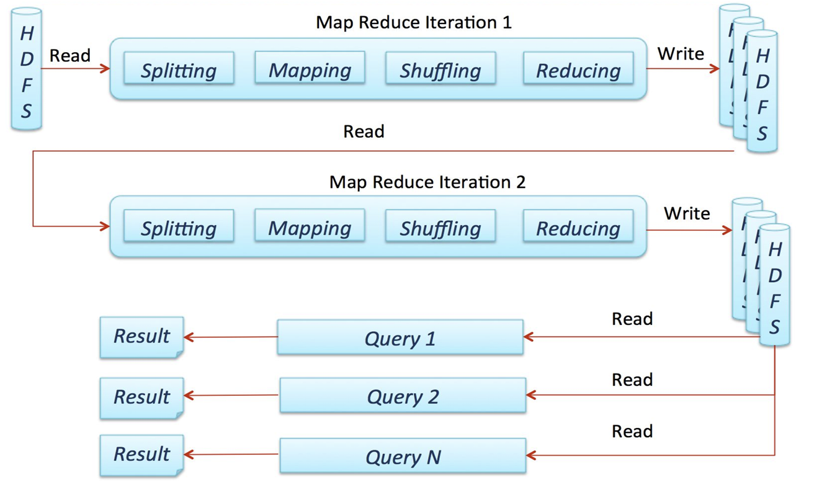

# Apache Spark Introduction

- [Apache Spark Introduction](#apache-spark-introduction)
  - [Before Apache Spark](#before-apache-spark)
    - [Issues with Traditional Large-Scale Systems: MapReduce](#issues-with-traditional-large-scale-systems-mapreduce)
    - [History](#history)
  - [Introducing Apache Spark](#introducing-apache-spark)
    - [What Is Apache Spark?](#what-is-apache-spark)
    - [Requirements for Apache Spark](#requirements-for-apache-spark)
    - [Hadoop vs Spark in Big Data Processing](#hadoop-vs-spark-in-big-data-processing)
    - [Major Benefits of Apache Spark](#major-benefits-of-apache-spark)
  - [Architecture](#architecture)
    - [Overview](#overview)
      - [Layer 1: High-Level Libraries](#layer-1-high-level-libraries)
      - [Layer 2: Spark Core](#layer-2-spark-core)
      - [Layer 3: Cluster Managers](#layer-3-cluster-managers)
    - [Spark Runtime Architecture: Driver and Workers](#spark-runtime-architecture-driver-and-workers)
      - [Master/Slave Architecture](#masterslave-architecture)
      - [How masters/slaves are integrated into the 3-layer architecture](#how-mastersslaves-are-integrated-into-the-3-layer-architecture)
    - [Spark Core Concepts](#spark-core-concepts)
      - [Driver Program and SparkSession](#driver-program-and-sparksession)
      - [Spark Dataflow](#spark-dataflow)
    - [Cluster Management](#cluster-management)
      - [Supported Cluster Managers](#supported-cluster-managers)
      - [Executor and Task Management](#executor-and-task-management)
    - [Architecture Summary](#architecture-summary)
      - [Kubernetes Architecture](#kubernetes-architecture)


---

## Before Apache Spark

### Issues with Traditional Large-Scale Systems: MapReduce

In this section, we explore the limitations and challenges associated with traditional large-scale systems like MapReduce. Although MapReduce revolutionized data processing by enabling distributed computing, it also introduced several inefficiencies and complexities. Understanding these issues provides a foundational context for appreciating the innovations and improvements brought by Apache Spark.


- **Batch Oriented**: MapReduce and similar MR-based systems (like Hive and Pig) are designed to process data in large batches. This means they are good for processing large volumes of data at once, but they are not designed to handle real-time data or respond to new data as it arrives.
- **Great Throughput but High Latency**: While these systems can handle a large amount of data (high throughput), they are slow in terms of the time it takes to process and return results (high latency). This makes them unsuitable for applications that require immediate feedback.
  - Not suitable for BI tools.
  - Not suitable for real-time (stream) processing.
  - Only useful for ingesting streaming data with Flume: While tools like Flume can be used to collect and move streaming data into a system that uses MapReduce, the actual processing of that data still occurs in batches, not in real-time.

- **Forces to Concatenate Multiple Jobs**
  - Requires external orchestration: Complex data processing tasks often need to be broken down into multiple steps, each requiring a separate MapReduce job. These jobs need to be coordinated and managed externally, adding complexity to the workflow.

- **Each Job Flushes to Disk**: After each MapReduce job completes, the intermediate data is written to disk. This disk I/O operation is time-consuming and contributes to the overall latency of the system.

- **Data Sharing Requires External Storage**: Sharing data between different jobs or processes requires storing it in an external storage system, such as HDFS (Hadoop Distributed File System). This adds another layer of complexity and potential performance bottlenecks. Below are some images that illustrate data sharing:




In MapReduce, intermediate results are stored on disk, causing jobs to be more I/O bound than computationally bound. While this is acceptable for tasks such as ETLs (Extract, Transform, Load), data consolidation, and data cleansing, where processing times are not critical, it poses significant challenges for scenarios requiring faster data processing and lower latency.

Big Data use cases, where processing time is crucial:
- **Streaming Data Processing**: 
  - Needed for near real-time analysis.
  - Example: Clickstream data analysis for making video recommendations to enhance user engagement.
  - Involves a trade-off between accuracy and processing time.
- **Interactive Querying of Large Datasets**: 
  - Enables data scientists to run ad-hoc queries on datasets.

### History


- **2002**: The concept of MapReduce was introduced at Google, revolutionizing the way large-scale data processing was handled.
- **2004**: Google published the MapReduce paper, detailing the methodology and its applications, which laid the groundwork for future distributed data processing frameworks.
- **2006**: Yahoo! implemented Hadoop, an open-source framework based on the MapReduce model, further popularizing the approach for handling big data.
- **2008**: The first Hadoop Summit was held, marking a significant milestone in the growing community and ecosystem around Hadoop and related technologies.
- **2010**: The Spark paper was published, introducing Apache Spark as a new framework designed to improve upon the limitations of MapReduce by providing in-memory data processing capabilities.
- **2014**: Apache Spark became a top-level project within the Apache Software Foundation, solidifying its importance and widespread adoption in the big data community.


## Introducing Apache Spark

### What Is Apache Spark?

[*Wikipedia*](https://en.wikipedia.org/wiki/Apache_Spark): Apache Spark is an **open-source** unified analytics engine for large-scale data processing. Spark provides an interface for programming **clusters** with implicit data parallelism and fault tolerance. Originally developed at the University of California, Berkeley's AMPLab, the Spark codebase was later donated to the Apache Software Foundation, which has maintained it since.

### Requirements for Apache Spark

This section outlines the essential components needed for a successful Spark setup. 

- **Cluster Manager**: is crucial for orchestrating the resources and tasks across the nodes in the cluster. Spark supports several cluster managers:
  - **Standalone**: a simple cluster manager included with Spark. It's easy to set up and use for small to medium-sized deployments.
  - **Apache Mesos**: A more advanced, general-purpose cluster manager that can manage a variety of distributed applications, not just Spark.
  - **Hadoop YARN**: The resource manager in Hadoop 2, which allows Spark to run alongside other Hadoop applications, sharing resources efficiently.
  - **Kubernetes**: An open-source system for automating deployment, scaling, and operations of application containers, which can also manage Spark clusters.
  
- **Distributed Storage System**: is necessary to provide high-throughput access to large datasets. Options are:
  - **Hadoop Distributed File System (HDFS)**: A distributed file system designed to run on commodity hardware, providing high throughput access to data.
  - **Cassandra**: A distributed NoSQL database designed to handle large amounts of data across many commodity servers, offering high availability with no single point of failure.
  - **Amazon S3**: A scalable object storage service from Amazon Web Services, providing secure, durable, and highly-scalable cloud storage.


Additionaly, for development and testing purposes, Spark can operate in a **pseudo-distributed mode**, simulating a distributed environment on a single machine. 
 - Utilizes the local file system and one worker per CPU core. In this mode, Spark mimics a distributed environment by using the local file system and running one worker per CPU core on a single machine.


### Hadoop vs Spark in Big Data Processing

- **Hadoop's Approach**:
  - Distribute the data when it is stored. Hadoop distributes data across a cluster when it is stored, ensuring that data is located close to where it will be processed.

  - Run computation where the data is located. Hadoop moves computation to the data nodes to reduce network congestion and improve processing speed, a concept known as data locality.


- **Spark's Enhancement**:
  - **Data can be distributed in memory**. Unlike Hadoop, which writes intermediate results to disk, Spark keeps data in memory whenever possible, which significantly speeds up processing times.

  - **Improved lineage graph**. Spark uses a Directed Acyclic Graph (DAG) for processing data, which keeps track of transformations applied to the data. This allows for efficient fault recovery by only re-computing lost data from the original fault-tolerant dataset.


### Major Benefits of Apache Spark

- **Lightning Speed of Computation**: Data is loaded in distributed memory (RAM) over a cluster of machines.
  - Extends the MapReduce model to support more types of computations:
    - Interactive queries.
    - Stream processing.
  - Ability to run computations in memory.
  - Faster than MapReduce for complex applications running on disk.


- **High Accessibility**: Standard APIs in Java, Scala, Python, R, or SQL.

- **Compatibility**: Works with existing Hadoop ecosystems.

- **Convenience**: Interactive shells in Scala and Python (REPL).
  - Read-Eval-Print Loop (REPL): it's an interactive programming environment that:
    - *reads* the user input, 
    - *evaluates* the input, executing the code or expression in the current context
    - *prints* the result of the execution back to the user
    - This process repeats (*loop*), allowing users to enter new code, see the results, and continue interacting with the environment
  - Apache Spark provides interactive shells for both Scala and Python, which are known as REPLs. These shells allow users to quickly run Spark commands and see the results immediately.

- **Enhanced Productivity**: High-level constructs focus on the content of computation.

- **General-Purpose**:
  - Designed to be fast, highly accessible, and versatile for various types of data processing tasks.


## Architecture

### Overview


#### Layer 1: High-Level Libraries
This layer includes various high-level libraries built on top of Spark Core, each designed for specific types of data processing and analysis:

- **Spark SQL, Structured Data Processing**: 
  - Provides capabilities for working with structured and semi-structured data.
  - Enables querying data via SQL as well as integrating with other data sources.
- **Spark Streaming Real-Time Processing**:
  - Allows for real-time processing of streaming data.
  - Processes data in near real-time by dividing incoming data into small batches and processing them.
  - Can be used for applications such as real-time analytics, monitoring, and event detection.
- **MLib, Machine Learning**:
  - Offers scalable machine learning algorithms. 
  - It includes a variety of algorithms for classification, regression, clustering, collaborative filtering, and more.
  - Provides tools for feature extraction, transformation, and model evaluation.
- **GraphX, Graph Processing**: 
  - A library for graph processing and analysis.
  - Enables the creation, transformation, and computation of graphs.
  - Suitable for applications like social network analysis, page rank calculations, and pattern recognition.

#### Layer 2: Spark Core
The foundational layer of Apache Spark. Provides essential functionalities such as task scheduling, memory management, fault recovery, and interacting with storage systems.
- Implements the basic RDD (Resilient Distributed Dataset) abstraction, which allows for distributed data processing and transformations.
- Handles the execution of Spark jobs and manages the overall workflow.

#### Layer 3: Cluster Managers
This layer involves different cluster management systems that Spark can run on, managing resources and scheduling tasks across the cluster.
- **Standalone Scheduler**: simple built-in cluster manager provided by Spark.
- **YARN**: resource management layer of the Hadoop ecosystem.
- **Mesos**: general-purpose cluster manager that can manage a variety of distributed applications.

### Spark Runtime Architecture: Driver and Workers
The Spark Runtime Architecture is based on a master/slave model, with various components working together to execute a Spark application.

**Spark Application**: Composed of the driver and multiple executors. The interaction between these components is central to Spark's distributed computing model.

#### Master/Slave Architecture
- **Central Coordinator: Driver (a Java process).** The driver is the central coordinator of a Spark application. It is a Java process and is responsible for various critical tasks:
  - **Distributing Tasks**: The driver distributes tasks across the cluster. While it doesn't perform the computational tasks itself, it manages the execution of the application code.
  - **Building the DAG** (Directed Acyclic Graph): The driver constructs a DAG of instructions. This graph represents the sequence of transformations and actions to be performed on the data. Once the DAG is built, the driver schedules these tasks to be executed on the worker nodes.
  - Note: Although the driver program can be written in Scala, it runs on the Java Virtual Machine (JVM) since Scala is a language that operates on the JVM.

- **Worker Daemons: Executors (each a Java process)**. Executors are worker daemons, each running as a separate Java process. They are responsible for:
  - **Executing Tasks**: Executors carry out the tasks assigned to them by the driver.
  - **Storing Data**: They store data partitions in memory or disk storage as required.
  - **Reporting Results**: Executors report the status and results of the tasks back to the driver.

#### How masters/slaves are integrated into the 3-layer architecture
- **Driver**: The driver exists within Layer 2 (Spark Core) and operates across all three layers. It orchestrates task execution, interacts with the high-level libraries in Layer 1 to build execution plans, and communicates with the cluster managers in Layer 3 to manage resources.
- **Worker Nodes (Executors)**: Worker nodes are also a part of Layer 2 (Spark Core) but are deployed and managed across all three layers. They execute tasks defined by the high-level libraries, perform data processing and computations, and are managed by the cluster managers in Layer 3.


Example of driver-worker architecture:


Example of driver-worker architecture compatible with Hadoop:


### Spark Core Concepts

#### Driver Program and SparkSession

- The Driver Program **Defines Distributed Datasets on a Cluster**
  - The driver program is responsible for **defining the distributed datasets**, known as RDDs (Resilient Distributed Datasets), DataFrames, or Datasets. These are the primary abstractions Spark uses to handle distributed data.
  - By defining these datasets, the driver program specifies how data should be partitioned across the cluster and prepared for parallel processing.

- The Driver Program **Launches various Parallel Operations on the Datasets**
  - Once the datasets are defined, the driver program initiates parallel operations such as transformations (e.g., map, filter) and actions (e.g., collect, count) on these datasets.
  - These operations are distributed across the worker nodes in the cluster, which execute the tasks in parallel to process the data efficiently.

- The Driver Program **Can be a custom program or the Spark shell for interactive operations**.
  - Can be a custom-written application in Scala, Java, or Python that uses the Spark API to define and manipulate datasets.
  - Alternatively, can be an interactive Spark shell (available in Scala and Python), which allows users to type commands interactively and see immediate results. This is particularly useful for exploratory data analysis and debugging.

-The Driver Program  **Accesses Spark through a `SparkSession` Object** which represents a connection to a cluster.
  - The `SparkSession` object is the entry point for interacting with Spark. It encapsulates the environment in which the driver program operates and provides a way to access all of Spark's functionalities
  - Through the `SparkSession`, the driver program can connect to the cluster, create RDDs, DataFrames, and Datasets, and perform operations on them.


> **Clarification on `SparkContext` vs `SparkSession`:**
> `SparkContext` remains a part of Spark for legacy reasons, `SparkSession` is the modern, preferred way to interact with Spark. It encapsulates `SparkContext` and other contexts, offering a unified and simplified API for users.


#### Spark Dataflow

1. **Development and Connection**:
   - Spark applications are developed in what is referred to as the **driver program**. This program defines the logic for data processing tasks using Spark's APIs. The driver program is where you write your Spark code to manipulate data, apply transformations, and perform computations.

   - **Connects to the cluster through a `SparkSession`** object. The `SparkSession` serves as the entry point to Spark functionality, allowing the driver program to communicate with the cluster and manage distributed data processing tasks.
   
2. **Resource Definition and Configuration**:
   - All resources and configurations are defined in the `SparkSession`.
     - In the provided Python example below, the `SparkSession` is instantiated with configurations that define how the Spark application will execute on the cluster.

   - RDDs (Resilient Distributed Datasets) and other structures are created within this session.
     - In the Python code snippet, `df` represents a DataFrame created by reading data from a CSV file stored in HDFS (Hadoop Distributed File System).


```python
import findspark
findspark.init('/opt/mapr/spark/spark-2.0.1/') # Initialize Spark in Python environment

import pyspark
from pyspark.sql import SparkSession

# Create a SparkSession with specified configurations
spark = SparkSession.builder.appName("variable_selection")\
                            .config("spark.master", "yarn")\
                            .config("spark.eventLog.enabled", "true")\
                            .config("spark.executor.instances","5")\
                            .config("spark.executor.cores","3")\
                            .config("spark.executor.memory","5g")\
                            .getOrCreate()

# Read data from CSV file into a DataFrame
df=spark.read.csv('hdfs:/data/databases/cars.csv')

# Display the first few rows of the DataFrame
df.show()
```

The configuration applied was:
- `.config("spark.master", "yarn")` - Configuring Spark to run in YARN cluster mode.
- `.config("spark.eventLog.enabled", "true")` - Enabling event logging for Spark jobs.
- `.config("spark.executor.instances","5")` - Setting the number of executor instances to 5.
- `.config("spark.executor.cores","3")` - Configuring each executor to use 3 CPU cores.
- `.config("spark.executor.memory","5g")` - Allocating 5 GB of memory per executor.
- `.getOrCreate()` - Retrieving an existing `SparkSession` or creating a new one if none exists.


### Cluster Management
This layer involves different cluster management systems that Spark can run on, managing resources and scheduling tasks across the cluster. 

#### Supported Cluster Managers
- **Standalone Scheduler**: simple built-in cluster manager provided by Spark. Requires prior installation of Apache Spark on all nodes.
- **YARN**: resource management layer of the Hadoop ecosystem.
- **Mesos**: general-purpose cluster manager that can manage a variety of distributed applications.
- **Kubernetes**: An open-source system for automating deployment, scaling, and operations of application containers, which can also manage Spark clusters.

In the image below, the **Cluster Manager** is what is shown as "*Application*":


#### Executor and Task Management
**Executor**
- **A background process running on each worker node**: Each worker node in a Spark cluster runs one or more executor processes. These executors are responsible for executing the code sent to them by the driver program. They perform the actual computation and data storage for our Spark application. Executors run as long as the Spark application is running and they are terminated once the application is completed.

- **Launches different tasks for each transformation**: When a Spark job is executed, it is divided into tasks that are distributed across the cluster. Each transformation in your Spark job (like map, filter, reduceByKey) is broken down into a series of tasks. Executors receive these tasks from the Spark driver and execute them on the data they have been assigned. This means that each executor is responsible for running multiple tasks, depending on the stage of the job and the transformations being applied.


### Architecture Summary

Below image encompasses the latest concepts seen in architecture:


#### Kubernetes Architecture


An operator is responsible for managing all aspects of a cluster. If we were tasked with creating a Spark cluster on Kubernetes by tomorrow, configuring everything from the driver to the executors would be overwhelming. Operators simplify this process by handling the administration of clusters, whether they are for Spark, Kafka, or other systems. For Apache Spark, there is a specific operator known as the "Spark Operator" that significantly eases configuration. Additionally, these operators assist with the monitoring of the Spark cluster, making management much more straightforward.

For more information, visit: [github.com/kubeflow/spark-operator](https://github.com/kubeflow/spark-operator).