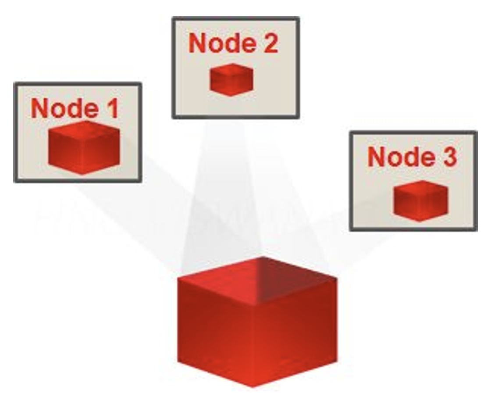
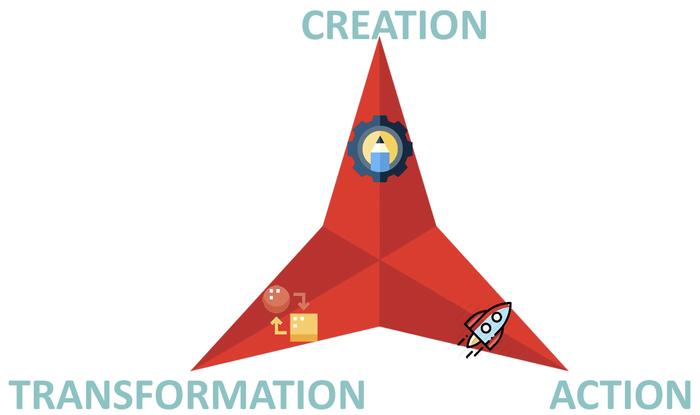
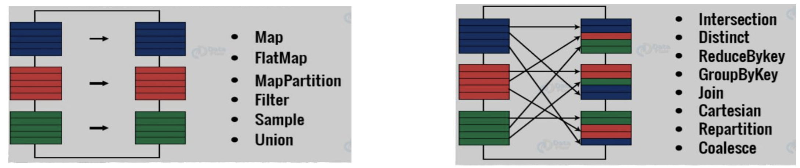
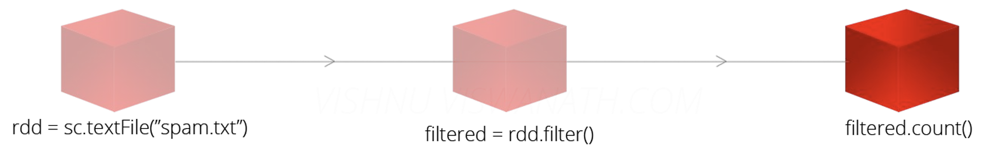
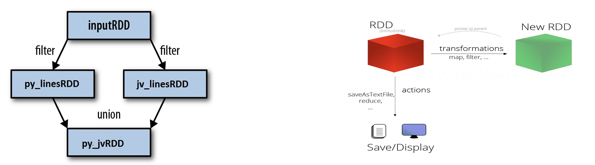
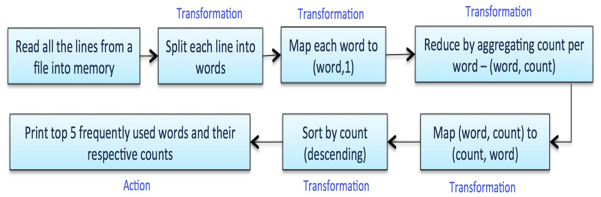
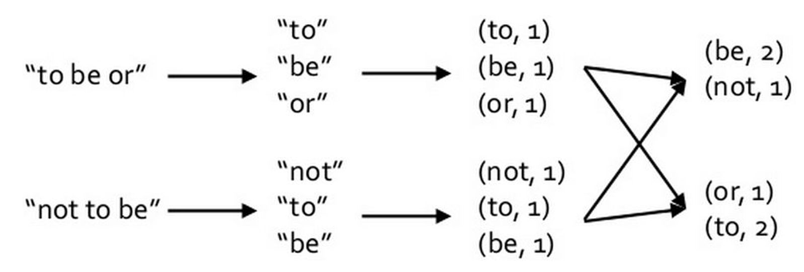
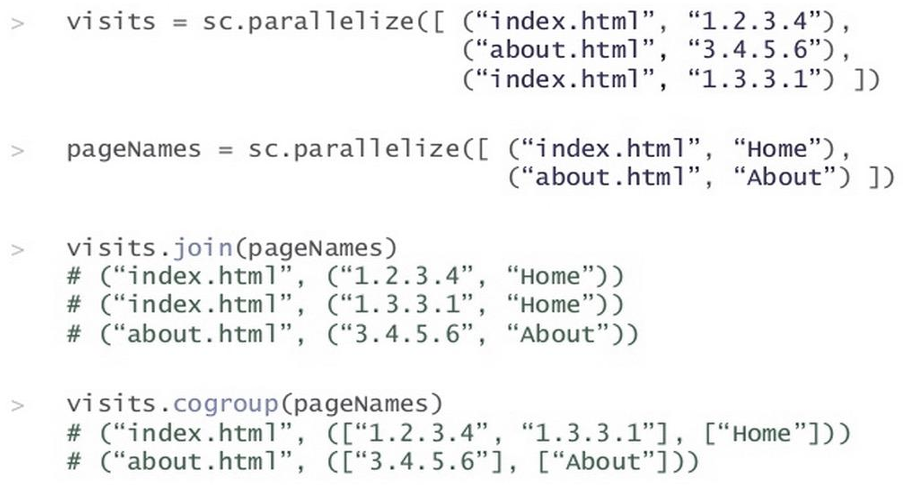

# Resilient Distributed Dataset (RDD)
- [Resilient Distributed Dataset (RDD)](#resilient-distributed-dataset-rdd)
  - [RDD Definition and Characteristics](#rdd-definition-and-characteristics)
  - [Types of Operations: Transformation vs Action](#types-of-operations-transformation-vs-action)
  - [Key Features of RDD](#key-features-of-rdd)
  - [RDD Operations](#rdd-operations)
    - [Creation](#creation)
    - [Transformation](#transformation)
    - [Action](#action)
    - [Visual Summary](#visual-summary)
    - [Example of RDD Operations in Python](#example-of-rdd-operations-in-python)
  - [RDD Transformations and Actions List](#rdd-transformations-and-actions-list)
    - [Transformations List](#transformations-list)
    - [Actions List](#actions-list)
  - [Key/Value Pairs RDD](#keyvalue-pairs-rdd)
    - [Special Operations for Pair RDDs](#special-operations-for-pair-rdds)
    - [Creating Pair RDDs](#creating-pair-rdds)
    - [Example: Word Count](#example-word-count)
    - [Example: Join and Cogroup](#example-join-and-cogroup)
  - [Executing Spark](#executing-spark)


## RDD Definition and Characteristics

**Definition**: A  RDD is an immutable, distributed collection of data that is partitioned across machines in a cluster. Spark's primary abstraction for working with data is the RDD, which possesses three key characteristics:
- It is **immutable**, meaning once created, it cannot be changed.
- It is **distributed**, allowing data to be spread across multiple nodes in a cluster for parallel processing.
- It is **partitioned**, enabling efficient data management and processing by dividing the dataset into smaller, manageable chunks.

  
## Types of Operations: Transformation vs Action

- **Transformation**:
  - These are operations such as `filter()`, `map()`, or `union()` on an RDD that result in the creation of a new RDD.
  - Transformations are **lazily evaluated**, meaning they don’t execute until an action is triggered. In other words, all transformations are recorded but not executed until an **action** initiates the process. Once an **action** is called, all the preceding transformations are executed.

- **Action**:
  - Actions are operations that trigger the execution of transformations and return a result to the driver program or write data to stable storage.
  - Actions are operations like `count()`, `first()`, `take(n)`, or `collect()` that trigger the actual computation.

More information can be found in [Medium - PySpark Transformation vs Actions](https://medium.com/@roshmitadey/pyspark-transformations-v-s-actions-797fc8ad16ea).


## Key Features of RDD

- **Resilient**: RDDs are immutable and cannot be modified once created. Spark's resilience is a key feature that ensures data reliability and fault tolerance. The **driver keeps track** of the transformations applied to an RDD, allowing it to recreate any lost partitions. If a partition is lost due to a node failure or other issues, it can be reconstructed on another machine in the cluster using the recorded transformations. This capability allows Spark to maintain data integrity and continue processing without significant disruptions.
  
- **Distributed**: Data in RDDs is distributed across the cluster, allowing for parallel processing and efficient data handling.
  
- **Dataset**: RDDs hold collections of data, serving as the fundamental data structure in Spark for managing and processing large-scale datasets.




## RDD Operations

This section describes each of these stages of the data lifecycle in Spark:
- Creation
- Transformation
- Action




### Creation

RDDs can be created in several ways, including by parallelizing an existing collection in your driver program, by referencing a dataset in an external storage system (such as HDFS, HBase, or any data source offering a Hadoop InputFormat), or by transforming an existing RDD.

- **From External Source**:
  - Examples: File, Kafka, MySQL, etc.
  - Code: `spark.sparkContext().textFile("file.csv")`.
  
- **From an Internal Structure**:
  - Code: `spark.sparkContext().parallelize(List(1, 2, 3, 4))`.
  
- **From Another RDD**:
  - Code: `otherRDD.map(word => (word, word.length))`.

### Transformation
- **Operations over RDDs that return a new RDD**: Transformations are operations that create a new RDD from an existing one. 
- **Lazy Evaluation**: They are lazily evaluated, meaning they only define a new RDD without immediately computing it. 
  - Only computed when an action requires a result to be returned to the driver program.
  - Note: Some transformations like `sortByKey` are not lazy.
- Examples include:
  - `map()`, which applies a function to each element in the RDD.
  - `filter()`, which returns a new RDD containing only the elements that satisfy a given condition.

> Note: Consider that SparkSQL transformations are other different kind of transformations.

**Types of Transformations in Apache Spark:**
In the context of Apache Spark, there are two main types of transformations applied to RDDs:

1. **Direct (Linear) Transformations**: These transformations operate independently on each element of the dataset. An example is the `map()` transformation, where each input element is processed separately, and its transformation does not depend on other elements in the dataset.

2. **Transformations Requiring Shuffling**: These transformations require data to be redistributed across different nodes in the cluster, as they depend on multiple elements. An example is the `reduceByKey()` transformation, which groups data based on keys and performs a reduction operation across all elements with the same key, necessitating data movement between nodes.

The figure below shows these two types of transformations:



To illustrate the difference further, consider the operations `reduceByKey()` and `groupByKey()`:
- **reduceByKey**: This operation pre-aggregates results on each node before shuffling the data across the cluster, reducing the amount of data that needs to be transferred.
- **groupByKey**: In contrast, this operation does not pre-aggregate results on the nodes. Instead, it shuffles all data based on keys and then groups them, which can be less efficient due to the higher volume of data transfer required.


### Action
Actions trigger the execution of transformations to produce a result. They perform computations and send the results back to the driver program or save them to an external storage system. Examples include:
  - `count()`, which returns the number of elements in the RDD.
  - `collect()`, which returns all the elements of the RDD to the driver.
  - `saveAsTextFile()`, which writes the data to a text file.
  - `reduce()`

**Usage**: Actions are used to either save a result to some location or display it.

> Be very cautious with actions; we should avoid `collect()` in our production applications as it can lead to an out-of-memory exception.

### Visual Summary

In the image below, we observe the complete life cycle: RDD creation (`sc.textFile`), transformation (`rdd.filter`), and action (`filtered.count`).



Other examples:



### Example of RDD Operations in Python

```python
# Read input text file into RDD (Transformation)
inputRDD = sc.textFile("README.md")

# Filter lines containing "Python" into a new RDD (Transformation)
py_linesRDD = inputRDD.filter(lambda line: "Python" in line)

# Filter lines containing "Java" into another RDD (Transformation)
jv_linesRDD = inputRDD.filter(lambda line: "Java" in line)

# Union the two RDDs to combine Python and Java lines (Transformation)
py_jvRDD = py_linesRDD.union(jv_linesRDD)

# Count the total number of lines in the combined RDD (Action)
print(py_jvRDD.count())
```

This Python code snippet demonstrates RDD operations in Apache Spark. First, the `textFile` method reads the contents of the "README.md" file into an RDD. Next, two transformations filter lines containing "Python" and "Java" respectively, creating `py_linesRDD` and `jv_linesRDD`. These filtered RDDs are then combined using the `union` transformation to create `py_jvRDD`. Finally, the `count()` action is applied to `py_jvRDD` to print the total number of lines containing either "Python" or "Java".

Note: If `jv_linesRDD` finishes processing earlier for any reason, subsequent operations must wait until it completes before continuing.

Another example:




## RDD Transformations and Actions List

### Transformations List

**Transformations** | **Meaning**
------------------- | -------------
`map(func)` | Return a new RDD formed by passing each element of the source through a function `func`.
`filter(func)` | Return a new RDD formed by selecting elements of the source where `func` returns true.
`flatMap(func)` | Similar to `map`, but each input item can be mapped to 0 or more output items.
`mapPartitions(func)` | Similar to `map`, but runs separately on each partition (block) of the RDD.
`mapPartitionsWithIndex(func)` | Similar to `mapPartitions`, but also provides `func` with the partition index.
`sample(withReplacement, fraction, seed)` | Sample a fraction of the data, with or without replacement, using a given random number generator seed.
`union(otherRDD)` | Return a new RDD that contains the union of the elements in the calling RDD and the argument.
`intersection(otherRDD)` | Return a new RDD that contains the intersection of the elements in the calling RDD and the argument.
`distinct()` | Return a new RDD that contains the distinct elements of the source dataset.
`groupByKey()` | When called on a dataset of (K, V) pairs, returns a dataset of (K, Iterable<V>) pairs.
`reduceByKey(func)` | When called on a dataset of (K, V) pairs, returns a dataset of (K, V) pairs aggregated using the given reduce function.
`aggregateByKey(zeroValue)(seqOp, combOp)` | Returns an RDD of (K, U) pairs, aggregating values for each key using the given combine functions and a neutral "zero" value.
`sortByKey([ascending])` | Returns an RDD of (K, V) pairs sorted by keys in ascending or descending order.
`join(otherRDD)` | When called on RDDs of type (K, V) and (K, W), returns an RDD of (K, (V, W)) pairs.
`cogroup(otherRDD)` | When called on RDDs of type (K, V) and (K, W), returns an RDD of (K, Iterable<V>, Iterable<W>) tuples.
`cartesian(otherRDD)` | When called on RDDs of types T and U, returns an RDD of all (T, U) pairs.
`pipe(command, [envVars])` | Pipe each partition of the RDD through a shell command.
`coalesce(numPartitions)` | Decrease the number of partitions in the RDD to `numPartitions`.
`repartition(numPartitions)` | Reshuffle the data in the RDD randomly to create either more or fewer partitions.
`repartitionAndSortWithinPartitions(partitioner)` | Repartition the RDD according to the given partitioner and sort records by keys within each partition.


### Actions List

**Action** | **Meaning**
---------- | -------------
`reduce(func)` | Aggregate the elements of the RDD using a function `func`.
`collect()` | Return all elements of the RDD as an array at the driver program.
`count()` | Return the number of elements in the RDD.
`first()` | Return the first element of the RDD.
`take(n)` | Return an array with the first `n` elements of the RDD.
`takeSample(withReplacement, num, [seed])` | Return an array with a random sample of `num` elements of the RDD.
`takeOrdered(n, [ordering])` | Return the first `n` elements of the RDD using their natural order or a custom comparator.
`saveAsTextFile(path)` | Write the elements of the RDD as a text file in the local filesystem, HDFS, or another Hadoop-supported file system.
`saveAsSequenceFile(path)` (Java and Scala) | Write the elements of the RDD as a Hadoop SequenceFile.
`saveAsObjectFile(path)` (Java and Scala) | Write the elements of the RDD using Java serialization.
`countByKey()` | Return a hashmap of (K, Int) pairs with the count of each key.
`foreach(func)` | Run a function `func` on each element of the RDD.


## Key/Value Pairs RDD

### Special Operations for Pair RDDs
- Spark provides specialized operations for RDDs that store data as (key, value) pairs, often referred to as Pair RDDs.
- These operations enable efficient parallel processing operations on each key and aggregation across the network. For example, transformations like `reduceByKey()` aggregate data locally on each partition before shuffling across the network, optimizing performance for tasks such as counting or aggregating values by key.

### Creating Pair RDDs
- Many data formats, such as Avro and JSON, naturally return RDDs structured as key/value pairs, aligning well with Spark's Pair RDD operations.
- For testing and Proof of Concepts (PoCs), you can easily create pair RDDs directly using `sc.parallelize(List((1, "a"), (2, "b"), (3, "c")))`. This approach allows quick setup of key-value data for experimentation.
- For regular RDDs: you can transform regular RDDs into pair RDDs using operations like `map`, where each element is mapped to a key-value pair. For instance, `lines.map(line => (line.split(" ")(0), line))` splits each line into words and assigns the first word as the key, effectively converting the RDD into a Pair RDD structure.

### Example: Word Count
```python
# Read the text file into an RDD
text_file = sc.textFile("hamlet.txt")

# Split each line into words, flatten the result into a single list of words
counts = text_file.flatMap(lambda line: line.split(" ")) \
                  # Map each word to a (word, 1) pair
                  .map(lambda word: (word, 1)) \
                  # Reduce by key (word) to count occurrences
                  .reduceByKey(lambda a, b: a + b) \
                  # Save the result to an HDFS file
                  .saveAsTextFile("hdfs://...")
```



### Example: Join and Cogroup




## Executing Spark

This section explains how to launch and configure Spark applications using the `spark-submit` command. It includes an example of the `spark-submit` command and details the various options available for customizing the execution environment.

- **Spark-submit Command**: Used to launch Spark on a cluster/single machine.

- **Example**:
  ```sh
  $ bin/spark-submit --master yarn --deploy-mode cluster --py-files otralib.zip, otrofich.py --num-executors 10 --executor-cores 2 mi-script.py script-options
  ```

- **Spark-submit Options**:
  - `master`: Cluster manager to use (e.g., `yarn`, `mesos://host:port`, `spark://host:port`, `local[n]`).
  - `deploy-mode`: Deployment mode (`client` for local, `cluster` for cluster).
  - `class`: Class to execute (Java or Scala).
  - `name`: Application name (displayed in Spark web UI).
  - `jars`: Jar files to add to the classpath (Java or Scala).
  - `py-files`: Files to add to the `PYTHONPATH` (`.py`, `.zip`, `.egg`).
  - `files`: Data files for the application.
  - `executor-memory`: Total memory for each executor.
  - `driver-memory`: Memory for the driver process.


