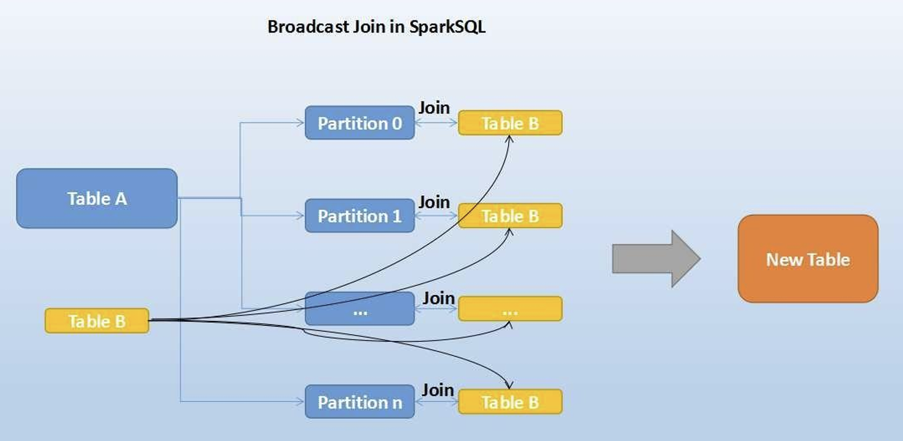
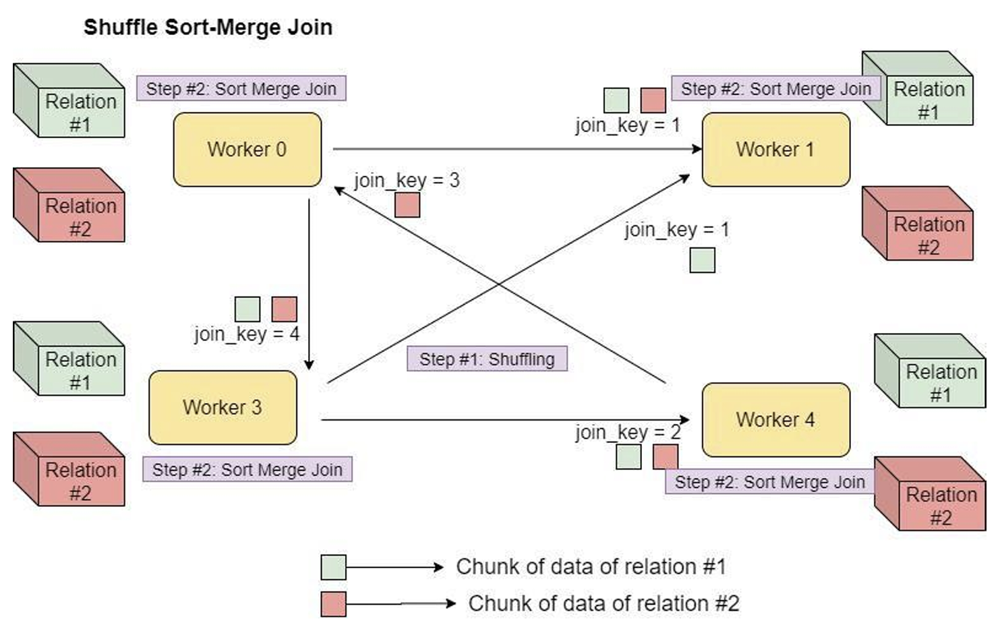

# Spark SQL

- [Spark SQL](#spark-sql)
  - [Introduction to Spark SQL](#introduction-to-spark-sql)
    - [Overview](#overview)
    - [Key Features of Spark SQL](#key-features-of-spark-sql)
    - [Component Stack](#component-stack)
    - [Details on Spark SQL - Hive Integration](#details-on-spark-sql---hive-integration)
  - [DataFrames and Datasets](#dataframes-and-datasets)
    - [Concept: DataFrames and DataSets](#concept-dataframes-and-datasets)
    - [Creation of DataFrames and DataSets](#creation-of-dataframes-and-datasets)
    - [Evolution: RDDs, DataFrames, and DataSets](#evolution-rdds-dataframes-and-datasets)
    - [DataFrames in PySpark](#dataframes-in-pyspark)
    - [Datasets in Scala](#datasets-in-scala)
    - [Spark APIs for DataFrame, SQL and RDD, which one do we choose?](#spark-apis-for-dataframe-sql-and-rdd-which-one-do-we-choose)
    - [DataFrames in SQL: Create a df from a file](#dataframes-in-sql-create-a-df-from-a-file)
    - [DataFrame Partitioning](#dataframe-partitioning)
    - [Repartition vs Coalesce](#repartition-vs-coalesce)
    - [Data Skew](#data-skew)
  - [Spark SQL Applications](#spark-sql-applications)
    - [Apache Spark Concepts: Job, Stage, Task](#apache-spark-concepts-job-stage-task)
    - [Save to Persistent Tables](#save-to-persistent-tables)
    - [Spark Context, SQL Context, Hive Context](#spark-context-sql-context-hive-context)
    - [SparkSession](#sparksession)
    - [User-Defined Functions (UDF) for Dataframes](#user-defined-functions-udf-for-dataframes)
    - [Spark SQL Evaluation Order](#spark-sql-evaluation-order)
    - [Querying JSON in Spark](#querying-json-in-spark)
    - [Columnar Storage](#columnar-storage)
    - [Conditional logic: "When...Otherwise"](#conditional-logic-whenotherwise)
  - [Windows Partitioning](#windows-partitioning)
  - [Data Cleaning](#data-cleaning)
    - [Handling Null Values](#handling-null-values)
    - [Replacing Null Values](#replacing-null-values)
  - [Catalyst - Spark's Optimizer](#catalyst---sparks-optimizer)
  - [Joins in Spark SQL](#joins-in-spark-sql)
  - [Optimizations](#optimizations)
    - [Data Skew Optimization (Spark 3.x)](#data-skew-optimization-spark-3x)
    - [Cost Based Optimizer (CBO) - 2.2.0](#cost-based-optimizer-cbo---220)
  - [Spark 3 Improvements](#spark-3-improvements)
    - [Adaptative Planning](#adaptative-planning)
    - [Dynamic Partition Pruning](#dynamic-partition-pruning)
    - [Coalesce](#coalesce)
  - [Caching](#caching)


---


## Introduction to Spark SQL

### Overview
Spark SQL was first released in Spark 1.0 (May, 2014). Initial development by Michael Armbrust & Reynold Xin from Databricks.


### Key Features of Spark SQL

- **Interface for Structured (Schema) and Semi-Structured Data**: Provides a unified interface for working with both structured (schema-based) and semi-structured data.

- **Structured Views on Data**: Applies structured views to data stored in various formats, allowing for consistent data manipulation and analysis.

- **Main Capabilities**
  - **DataFrame Abstraction**: Offers a DataFrame abstraction for handling structured datasets efficiently.
  - **Support for Multiple Formats**: Enables reading and writing data in various structured formats, including JSON, Hive, and Parquet.
  - **SQL Querying**: Allows querying data using SQL within Spark programs and from external tools via JDBC/ODBC.


- **Integrate SQL Queries with Spark Programs**
  - Process structured data, such as SQL tables and JSON files, as RDDs.
  - Seamlessly mix SQL queries with programming in Python within the same job.

- **Load and Query Data from Various Sources**
  - Apache Hive tables
  - Parquet files
  - JSON files
  - Cassandra column families

- **Run Unmodified Hive Queries**
  - Reuse the Hive metastore, data, queries, SerDes, and UDFs.
  - Note: This feature is now deprecated.

- **Connect Through JDBC or ODBC**
  - Spark SQL includes a server mode.
  - Allows the use of BI tools for data analysis and reporting.


### Component Stack

From a user perspective, Spark SQL provides:
- **Hive-like Interface**: Provides a JDBC service and CLI for user interaction.
- **SQL API Support**: Offers LINQ-like SQL API support.
- **SQL Dialects**: Supports both HiveQL and simple SQL dialects.
  - **HiveQL**: Aims for 100% compatibility with Hive DML (Data Manipulation Language).
  - **Simple SQL Dialect**: Less functional but easier to extend.
- **Hive Metastore Compatibility** for:
  - **DDL Compatibility**: 100% compatible with Hive Metastore for Data Definition Language (DDL).
  - **Configurable to use Hive Metastore**: which contains all Hive metadata, including table locations, formats, and structures. 
    - Note: Spark uses Hive's language but executes queries using Spark's engine, not Hadoop's MapReduce.


### Details on Spark SQL - Hive Integration

- Spark SQL can read and write data stored in Hive.
- Accessing Hive UDFs does not require Hive installation:
  ```scala
  SparkSession.builder().enableHiveSupport().getOrCreate()
  ```
- Add Spark-Hive Dependency:
  ```scala
  libraryDependencies ++= Seq(
      "org.apache.spark" %% "spark-sql" % sparkVersion,
      "org.apache.spark" %% "spark-hive" % sparkVersion
  )
  ```
  Note 1: Typically, in environments like Databricks, dependencies are pre-installed. This example demonstrates the process for other contexts.

  Note 2: Default Hive Metastore version is 1.2.1.

Example - Creating a Hive Managed Parquet Table using HQL syntax:
```scala
// Create a Hive managed Parquet table using HQL syntax (Hive) instead of Spark SQL native syntax
sql("CREATE TABLE hive_records(key int, value string) STORED AS PARQUET")
```

**Hive Metastore Configuration in Spark SQL**

We will see how Spark SQL handles the Hive metastore configuration, both when you have an existing Hive installation and when you do not.

- **Using an Existing Hive Installation:**
  - If you already have Hive installed, you need to copy the `hive-site.xml` file to the Spark configuration directory. This file contains the necessary settings for Spark to connect to your existing Hive metastore.

- **Without a Hive Installation:**
  - If you don't have Hive installed, Spark SQL will automatically create its own Hive metastore in the program’s working directory, under a directory named `metastore_db`.
  - The default location for Hive tables will be `/user/hive/warehouse`, which will be on the local filesystem or HDFS, depending on whether you have `hdfs-site.xml` on your classpath.
  - The location for Hive tables can be configured using the `hive.metastore.warehouse.dir` setting.


## DataFrames and Datasets

### Concept: DataFrames and DataSets

Dataframes and Datasets in Spark SQL represent distributed collections of data, similar to RDDs (Resilient Distributed Datasets), but **with added schema information** that makes them more suitable for semi-structured or structured data.

One of the key advancements in Dataframes and Datasets is the [Tungsten execution engine](https://www.databricks.com/glossary/tungsten), which significantly improves memory management within the JVM, resulting in a more efficient storage layer.

Dataframes and Datasets not only provide a variety of new operations, such as `reduceByKey`, but they also enable the execution of SQL queries. This expands the range of operations, often rendering older methods obsolete.


### Creation of DataFrames and DataSets

Dataframes and Datasets can be created from various sources:

- **External data sources**: Such as HDFS, S3, or local files.
- **Result of queries**: Derived from the results of SQL queries.
- **Regular RDDs**: Converting existing RDDs into Dataframes.

Note: While Dataframes in Spark share similarities with those in the Pandas library, it is important to note that converting a Spark Dataframe to a Pandas Dataframe using `toPandas()` will result in losing the distributed nature of the Spark Dataframe. This conversion will bring all the data into the driver node, which may lead to performance bottlenecks and memory issues for large datasets.


### Evolution: RDDs, DataFrames, and DataSets


**RDD (2011)**
- **Unstructured**: RDDs (Resilient Distributed Datasets) are collections of JVM objects without any schema.
- **Distributed Collections**: They distribute collections of JVM objects across the cluster.
- **Functional Operators**: Provide basic functional operators like `map` and `filter`.

**DataFrame (2013)**
- **Structured**: DataFrames add schema information, providing structure to the data.
- **Row Objects**: Distributed collections of Row objects.
- **UDFs**: Support for User Defined Functions (UDFs) to perform custom operations.
- **Expression-Based Operations**: Enable complex operations based on expressions.
- **Logical Plans and Optimizer**: Utilize logical plans and a query optimizer for efficient execution.
- **Efficient Storage**: Fast and efficient internal representations.

**Dataset (2015)**
- **Structured Collections and JVM objects**: Allow storing objects of specific types like "Car" or "Person" (this was not possible with DataFrame). Internal rows, externally JVM objects.
- **Type Safe and Fast**: Combine the advantages of type safety and performance.
- **Not in PySpark**: Datasets are available in Spark with Scala and Java, but not in PySpark due to Python's lack of static typing.
  - **Limited Adoption**: Primarily used when there's a need to store type-specific objects. The adoption is low compared to DataFrames.
  - Slower than DF.
- **Unified with DataFrames**: Starting in Spark 2.0, DataFrames and Datasets were unified, allowing for similar functionalities across both.

While Datasets provide type safety and can store specific object types, their use is less common, especially in Python, where DataFrames remain the primary structure due to their efficiency and broader support for complex operations and interactive analysis.


> Starting in Spark 2.0, DataFrame APIs will merge with Datasets APIs, unifying data processing capabilities across libraries. Because of this unification, developers now have fewer concepts to learn or remember, and work with a single high-level and type-safe API called Dataset.
>
> Starting in Spark 2.0, Dataset takes on two distinct APIs characteristics: a strongly-typed API and an untyped API. Conceptually, consider DataFrame as an alias for a collection of generic objects Dataset[Row], where a Row is a generic untyped JVM object. Dataset, by contrast, is a collection of strongly-typed JVM objects, dictated by a case class you define in Scala or a class in Java.

More information can be found in [A Tale of Three Apache Spark APIs: RDDs vs DataFrames and Datasets (databricks.com)](https://www.databricks.com/blog/2016/07/14/a-tale-of-three-apache-spark-apis-rdds-dataframes-and-datasets.html).

### DataFrames in PySpark

Here's a brief example to illustrate how to create and work with DataFrames in PySpark:

```python
fifa_df = spark.read.csv("path-of-file/fifa_players.csv", inferSchema = True, header = True)
fifa_df.show()
```

In this example, we read a CSV file containing FIFA player data into a DataFrame. The `inferSchema=True` parameter automatically infers the schema of the DataFrame based on the data. This means that PySpark will analyze the data and determine the appropriate data types for each column. However, you also have the option to manually define the schema if needed for more control.

To manually define the schema, you can use a `StructType` object to specify the data types for each column explicitly.


To inspect the schema of the DataFrame and understand the structure of your data, you can use the `printSchema()` method:

```
fifa_df.printSchema()
```


### Datasets in Scala

**Example 1:**

In Spark, a Dataset is a distributed collection of data that provides the benefits of RDDs (Resilient Distributed Datasets) along with the optimizations and conveniences of DataFrames:
- Dataset is a collection of strongly-typed JVM.
- Python does not support Spark Datasets.

The code below shows how to define a case class, create a sequence of instances of that class, convert it into a Dataset, and display the content of the Dataset.


```scala
case class Person(name: String, age: Int)

val personDS = Seq(Person("Max", 33), Person("Adam", 32), Person("Muller", 62)).toDS()
person.show()
```
- Case classes in Scala are special types of classes that come with built-in features like immutability, pattern matching, and a default `toString` method, among others.
- `Seq(Person("Max", 33), Person("Adam", 32), Person("Muller", 62))` creates a sequence containing three Person objects with the specified name and age.
- `toDS()` converts this sequence into a Dataset. Spark has inferred the name and type of the class. It is similar to the `paralellize` saw before.


If the Person class has a method, for example, `getAge()`, you can leverage this method when working with the Dataset. For instance:

```scala
case class Person(name: String, age: Int) {
  def getAge(): Int = age
}

val personDS = Seq(Person("Max", 33), Person("Adam", 32), Person("Muller", 62)).toDS()

val agesDS = personDS.map(person => person.getAge())
agesDS.show()
```

In this example:
- **Defining a Method**: The `Person` class has a `getAge()` method that returns the age of the person.
- **Using `map` on Dataset**: The `map` function is used on `personDS` to create a new Dataset `agesDS` by applying the `getAge()` method on each `Person` object.
- **Displaying the Result**: The `agesDS.show()` line will display the ages of all persons in the Dataset.

**Example 2:**

You can simply call `.toDS()` on a sequence to convert the sequence to a Dataset. In this case, we create a dataset of integers:

```
val dataset = Seq(1, 2, 3).toDS()
dataset.show()
```


**Example 3:**

Now let's look at the changes: first we create a rdd, and then we move it to a dataset using `rdd.toDS()`:


1. We create a `Seq` sequence.
2. With `parallelize` we create a RDD.
3. Once we have the RDD, with `toDS` we create the dataset.

**Example 4:**

Create Dataset from a DataFrame, using `df.as[SomeCaseClass]`


1. We first create a dataframe using `.toDF()`.
2. Then, we create a dataset using `df.as[SomeCaseClass]`.


### Spark APIs for DataFrame, SQL and RDD, which one do we choose?
All three approaches aim to achieve the same goal: calculate the average age of individuals in each department. They do so using different APIs within Spark:

**DataFrame API**
```scala
data.groupBy("dept").avg("age")
```
- Uses the DataFrame API to group the data by the `dept` column and calculate the average age for each department. It returns a DataFrame with two columns: `dept` and the average age for that department.

**SQL Query**
```scala
spark.sql("SELECT dept, AVG(age) FROM data GROUP BY dept")
```
- Executes an SQL query to group the data by the `dept` column and compute the average age for each department. It returns the same as the DataFrame API approach.

**RDD API**
```scala
data.map { case (dept, age) => dept -> (age, 1) }
    .reduceByKey { case ((a1, c1), (a2, c2)) => (a1 + a2, c1 + c2) }
    .map { case (dept, (age, c)) => dept -> age / c }
```

- **First `map`**: Transforms each record into a key-value pair `(dept, (age, 1))`, where `1` is a count of one individual.
- **`reduceByKey`**: Combines records with the same `dept` key by summing up the ages and counts, resulting in `(dept, (total_age, total_count))`.
- **Second `map`**: Transforms each `(dept, (total_age, total_count))` pair into `(dept, average_age)` by dividing `total_age` by `total_count`.
- **Result**: It returns an RDD with two elements: `dept` and the average age for that department.

**Which One Should We Choose? DataFrame vs SQL vs RDDs**

First, let's discard RDDs. Although RDDs offer detailed control over operations and are highly flexible, they are more complex and less efficient compared to DataFrames and SQL.

Advantages of DataFrames:

- **Shorter Syntax**: DataFrames allow for writing more concise and readable code.
- **Compile-time Errors**: DataFrame queries are checked at compile time, helping to catch errors before the code runs.
- **Lazy Transformations**: All transformations in DataFrames are evaluated lazily, except for schema calculation. This enables optimizations before query execution.

Advantages of SQL:

- **Adoption by Data Analysts**: With the expansion of tools like Databricks towards data analytics, SQL usage is becoming more common among data analysts.
- **Readability and Familiarity**: SQL is a well-known and widely used language in data analytics, making it easier for a broader audience to adopt.

Disadvantages of SQL:

- **Runtime Errors**: SQL queries are strings, and errors in them are not detected until runtime, unlike DataFrames which catch errors at compile time.
- **Lazy Evaluation**: While SQL in Spark also evaluates lazily, schema errors are detected only during the execution of transitions, which can delay problem identification.

While most current documentation and examples are in DataFrame format, SQL usage is gaining relevance due to its accessibility for data analysts. **The choice between DataFrames and SQL depends on the context and the team working on the projects**, but it's important to be familiar with both options.


### DataFrames in SQL: Create a df from a file
In Spark, you can run SQL queries directly on files without first loading them into a DataFrame using the read API. This method allows you to query files as if they were tables in a database.

```python
df = spark.sql("SELECT * FROM parquet.`./resources/users.parquet`")
```

This approach simplifies the process by eliminating the need to load the file into a DataFrame first. You can perform complex SQL queries on the file as if it were a table.


### DataFrame Partitioning

Data partitioning is crucial for efficient data processing, especially when dealing with large volumes of data. Spark assigns one task per partition, which is essential for optimizing resource utilization. Key points:

- **Few Partitions**: If there are too few partitions, the application won't utilize all available CPU cores efficiently.
- **Too Many Partitions**: Conversely, having too many partitions can lead to significant overhead.

Spark will assign as many tasks as there are partitions. Here's the basic rule:
- **1 task = 1 partition = 1 core**

This approach is beneficial because it allows us to use all available resources. However, the optimal number of partitions isn't always equal to the number of cores. The ideal scenario might seem to be having as many partitions as cores, but there are several considerations:

1. **Dynamic Data Size**: Data size isn't static. In batch processing, a table's size can vary day-to-day, which means the number of required partitions can change. The same principle applies to streaming data.
2. **Variable Partition Sizes**: Dataframes won't always have uniform partition sizes. Operations like `group by` or `join` can lead to data shuffling and imbalanced partitions. For example, some categories in a dataset might be significantly larger than others.

To manage partition sizes effectively, you can use the `df.repartition()` operation. This operation reshuffles the data to create a more balanced partitioning:

```python
df = df.repartition(numPartitions)
```

This command triggers a shuffle to redistribute data across the specified number of partitions, helping to balance the load and improve performance.

**Conclusion:**

- **Optimal Partitioning**: Aim for a balance that neither underutilizes nor overburdens the system.
- **Dynamic Adjustment**: Use repartitioning to handle changes in data size and distribution, ensuring efficient resource use and performance.


See more information in [Spark Partition (luminousmen.com)](https://luminousmen.com/post/spark-partitions).

### Repartition vs Coalesce

**Repartitioning** can be used to either increase or decrease the number of partitions in your DataFrame:

- **Full Shuffle Operation**: Repartitioning involves a complete shuffle of the data across the cluster.
- **Equal Distribution**: The resulting partitions are evenly distributed, which helps in balancing the workload.

```scala
val new_df = df.repartition(100) // to repartition a DataFrame into 100 partitions
val new_df = df.repartition(100, $"id") // to repartition based on a specific column (e.g., `id`), ensuring that rows with the same `id` end up in the same partition
```

**Coalesce** is used to reduce the number of partitions in your DataFrame:

- **Avoids Shuffle**: Coalesce is more efficient than repartitioning when reducing the number of partitions because it avoids a full shuffle of the data. It simply combines existing partitions without redistributing the data across the cluster.


```scala
val new_df = df.coalesce(10) // to reduce the number of partitions to 10
```


### Data Skew

Data skew occurs when data is unevenly distributed across partitions, leading to performance bottlenecks.


Here are some strategies to handle data skew effectively:

- Repartition data on a more evenly distributed key if you have such.
- Broadcast the smaller DataFrame if possible: When joining a large DataFrame with a smaller one, broadcast the smaller DataFrame to avoid shuffling large amounts of data.
- Split data into skewed and non-skewed data and work with them in parallel by redistributing skewed data (differential replication).
- Use salting: Add a random key to the skewed data to spread it more evenly across partitions.
- Apply iterative broadcast join.
- There are more complex methods available, though they are rarely used in practice..

## Spark SQL Applications

### Apache Spark Concepts: Job, Stage, Task

- **Cluster**
  - Group of JVMs (nodes) connected by the network, each of which runs Spark, either in Driver or Worker roles.

- **Driver**
  - This is one of the nodes in the Cluster.
  - Don’t run computations.
  - It plays the role of a master node.
  - It generates the acyclic network, decides where everything is executed.

- **Executor**
  - Executors are JVMs that run on Worker nodes.
  - Actually run Tasks on data Partitions.
  - The tasks apply the transformation on each of the partitions.

- **Job**
  - A job is a sequence of Stages, triggered by an Action such as `.count()`, `read()`, `write()`, ...
  - It is the complete pipeline.

- **Stage**
  - A stage is a sequence of Tasks that can all be run together, in parallel, without a shuffle.
  - Everything that is executed within a stage is parallelizable, it does not depend on each other.

- **Task**
  - A Task is a single operation applied to a single partition.
  - Each Task is executed as a single thread in an Executor.


Actually, when we execute a transformation in dataframe, underneath there is a RDD. That is why the RDD appears in the image.


### Save to Persistent Tables

When working with a `HiveContext`, DataFrames can be saved as persistent tables using the `saveAsTable` command. This offers a robust way to store your data within the HiveMetastore.

Key points:

1. **Materialized Contents**
   - The `saveAsTable` command materializes the contents of the DataFrame and creates a pointer to the data in the HiveMetastore, unlike `registerTempTable`, which only registers the DataFrame as a temporary table.
   
2. **Persistence Across Sessions**
   - Persistent tables remain available even after your Spark program has restarted. This makes them a reliable choice for long-term storage of critical data.

3. **Managed Tables by Default**
   - By default, `saveAsTable` creates a "managed table". This means the HiveMetastore controls the location of the data.
   - When a managed table is dropped, its data is automatically deleted.

Example:
```scala
df.write.saveAsTable("persistent_table_name")
```


### Spark Context, SQL Context, Hive Context

In earlier versions of Spark, the architecture included separate contexts for different functionalities (and not the Spark Session as now). This approach was a bit confusing, but understanding these contexts can be helpful if you encounter older Spark applications.


**Old components:**

SparkContext
- **Role**: The main entry point for Spark functionality.
- **Functionality**: Used by the driver program to connect and communicate with the cluster (e.g., YARN, Mesos).
- **Access**: Through SparkContext, you could access SQLContext and HiveContext.
- **Configuration**: Responsible for setting configuration parameters.

SQLContext
- **Role**: Gateway to SparkSQL.
- **Functionality**: Allows you to work with structured data using SQL queries within Spark.

HiveContext
- **Role**: Gateway to Hive.
- **Functionality**: Extends SQLContext to include Hive functionalities, enabling interaction with Hive tables and queries.

### SparkSession
**Modern Spark**

Today, these contexts are considered outdated. The introduction of SparkSession in Spark 2.0 unified these contexts, simplifying the API:

- **SparkSession**: 
  - Acts as the single entry point for all functionalities: All contexts unified into only one.
  - Internally manages SparkContext, SQLContext and HiveContext functionalities.
  - Example: When you use `spark.sql`, it internally accesses the SQLContext.
  - We can start working with DataFrame and Dataset having access to SparkSession.


**Example: SparkSession in PySpark**
This Python code initializes a Spark session using PySpark. 

```python
from pyspark.sql import SparkSession

spark = SparkSession \
  .builder \
  .appName("Python Spark SQL basic example") \
  .config("spark.some.config.option", "some-value") \
  .getOrCreate()
```
  - **SparkSession.builder**: Starts the configuration process for creating a new Spark session.
  - **.appName("Python Spark SQL basic example")**: Sets the name of the Spark application.
  - **.config("spark.some.config.option", "some-value")**: Sets a configuration option for the Spark session. This is an example configuration and can be replaced with any valid Spark configuration parameter.
  - **.getOrCreate()**: Creates the Spark session if it doesn’t already exist, or retrieves the existing session.

**Example: Spark Session in Scala**
Initializes a Spark session with Hive support and reads a JSON file into a DataFrame:
```scala
val spark = SparkSession
  .builder
  .enableHiveSupport()                 // Enable Hive support, allowing interaction with Hive data sources
  .config("spark.master", "local[*]")  // Set Spark to run locally with all available cores
  .appName("Simple Application")       // Set the name of the application
  .getOrCreate()                       // Create the Spark session if it doesn't already exist, or retrieve the existing one

val filePath = "person.json"           // Path to the JSON file to be read
val persons = spark
  .read                                // Initialize DataFrameReader to read data
  .json(filePath)                      // Read the JSON file at the specified path into a DataFrame

val personsByName = persons
  .groupBy(col("name"))                // Group the DataFrame by the "name" column
  .count                               // Count the occurrences of each name in the grouped DataFrame

personsByName.show()                   // Display the results of the grouping and counting
```
When running Spark locally, you need to create your own Spark session. Key points:
- **Resource Manager Configuration**: By setting the `spark.master` configuration to `local[*]`, you're specifying that the resource manager for your Spark application will be Spark itself, running locally.
- **Using All Cores**: The asterisk (`*`) is crucial as it tells Spark to use all available cores on your machine. If you specify a number instead, Spark will use that number of cores.


### User-Defined Functions (UDF) for Dataframes

User-defined functions (UDFs) allow you to extend the DataFrame and SQL APIs while maintaining the advantages of Spark's Catalyst optimizer. Here’s how you can define and use UDFs in Spark:

**UDFs in Scala**

You can register a UDF and use it in SQL queries:

```scala
// Define a UDF (User-Defined Function) named squared that computes the square of a Long
val squared = (s: Long) => s * s

// Register the UDF with Spark SQL, naming it "square"
spark.udf.register("square", squared)

// Execute a SQL query using the registered UDF to compute id_squared from the 'test' DataFrame or table
spark.sql("select id, square(id) as id_squared from test").show()
```

You can also use UDFs directly with DataFrames:

```scala
// Import necessary classes and functions from Spark SQL
import org.apache.spark.sql.functions.{col, udf}

// Define a UDF (User-Defined Function) named squared using 'udf' function
val squared = udf((s: Long) => s * s)

// Apply the UDF 'squared' to the 'id' column of DataFrame 'df'
// and alias the result as 'id_squared'. Then, display the results.
df.select(squared(col("id")).as("id_squared")).show()
```


**UDFs in PySpark**

In PySpark, the default return type of a UDF is `StringType`, but you can specify other return types as well.

```python
def squared(s): return s * s
spark.udf.register("squaredWithPython", squared)
```
You can optionally set the return type of your UDF using PySpark types:

```python
from pyspark.sql.types import LongType
def squared_typed(s): return s * s
spark.udf.register("squaredWithPython", squared_typed, LongType())
```

**Performance Considerations**

- **Performance Issues with Python UDFs**: Using UDFs in Python can have performance drawbacks because data needs to be transferred out of the JVM. This can slow down your application, especially with large datasets.
- **Optimizing UDF Execution**: There might be scenarios where you want to execute a function across multiple cores without changing the number of partitions. This can be done by creating a comprehensive function within the UDF that includes loops and multiple function calls. However, it’s rarely seen in practice due to complexity and potential performance issues.


### Spark SQL Evaluation Order

Spark SQL, including SQL queries and the DataFrame and Dataset APIs, does not guarantee the order of evaluation of subexpressions. When using Spark SQL, there's no assurance that certain conditions or checks will be evaluated before others. This means that Spark SQL may not always execute subexpressions in the order you might expect.

Example:

```python
# Register a UDF named 'strlen' that returns the length of the input string
spark.udf.register("strlen", lambda param1: len(param1), "int")

# SQL query to select rows where the column 's' is not null and its length is greater than 1
spark.sql("select s from test1 where s is not null and strlen(s) > 1")
```

In this example, Spark SQL does not guarantee that the `s is not null` condition will be evaluated before the `strlen(s) > 1` condition. This means the UDF strlen could be called with `null` values, potentially leading to errors or unexpected behavior.

To perform proper null checking, we recommend that you do either of the following:
- Make the UDF itself null-aware and do `null` checking inside the UDF itself.
- Use `IF` or `CASE WHEN` expressions to do the `null` check and invoke the UDF in a conditional branch.

Example:
```python
# Register a UDF named 'strlen_nullsafe' that returns the input string's length
# If the input string is None (null), it returns -1 instead
spark.udf.register("strlen_nullsafe", lambda s: (s) if not s is None else -1, "int")

# Execute a SQL query to select rows where 's' is not null and the UDF 'strlen_nullsafe'
# returns a value greater than 1. This ensures safe handling of null values.
spark.sql("select s from test1 where s is not null and strlen_nullsafe(s) > 1")

# Execute a SQL query to select rows where the length of 's' is greater than 1.
# The 'if' function checks if 's' is not null, then applies the UDF 'strlen',
# otherwise it returns null. This ensures that the UDF is not called on null values.
spark.sql("select s from test1 where if(s is not null, strlen(s), null) > 1")
```


  
### Querying JSON in Spark
Spark allows you to query JSON objects using the DataFrames API, making it straightforward to access and manipulate nested structures and arrays within your JSON data. Here’s how you can do it:

**Accessing Structs**

In Spark, a struct is a complex type that groups together multiple fields. When your JSON data contains nested structures (structs), you can easily access and work with these nested fields.

Example Schema:
```
root
|-- key: string (nullable = true)
|-- new_batter: struct (nullable = true)
|    |-- id: string (nullable = true)
|    |-- type: string (nullable = true)
```

To access fields within the `new_batter` struct, you can use the following code:

```scala
bat2DF.select("key", "new_batter.*").show()
```
- `bat2DF.select("key", "new_batter.*")`: This code selects the `key` column and all fields within the `new_batter` struct. The `*` notation is used to expand the fields within the struct, so both `id` and `type` fields within `new_batter` are selected.
- `.show()`: This displays the resulting DataFrame.


**Accessing Arrays**

If your JSON data includes arrays, you can access elements within these arrays by their index.

Example Code:
```python
df.select(col("departments")[0].alias("primaryDepartment"))
```
- `col("departments")[0]`: This selects the first element (index 0) from the `departments` array.
- `.alias("primaryDepartment")`: This renames the selected array element to `primaryDepartment` for better readability in the resulting DataFrame.


### Columnar Storage

Columnar storage is an efficient data storage format that stores data by columns rather than rows. This method offers several advantages, particularly in the context of big data processing frameworks like Apache Spark.

**Apache Parquet** is a popular columnar storage format supported by Spark. It leverages the advantages of columnar storage to enhance both compression and query performance.

**Advantages of Columnar Storage**

1. **Compression**: Allow for highly efficient compression. Since data in a column tends to be of the same type and similar in value, it compresses better than row-based storage.

2. **Efficient Data Representation**: Columnar formats optimize read performance. When a query accesses only a subset of columns, only the relevant columns are read from disk, significantly reducing the I/O overhead. This is particularly beneficial for analytics and big data scenarios where operations often target specific columns rather than entire rows.


Column chunks consist of pages that are written sequentially. Each page has a common header, allowing readers to skip over pages they don't need. The actual data for each page comes after the header and can be compressed or encoded. The specific compression and encoding methods are detailed in the page metadata.


### Conditional logic: "When...Otherwise"

In Spark, you can use the `when` and `otherwise` methods to create conditional logic within DataFrames, similar to SQL's `CASE WHEN`, a switch statement, or an if-then-else statement.

For example, you can create a new column in a DataFrame based on the values of an existing column:

```python
df_when2 = df.select(col("*"), when(col("Gender") == "M", "Male")
      .when(col("Gender") == "F", "Female")
      .otherwhise("Unknown").alias("New_gender"))

df_when2.show()
```


In this example, a new column `New_gender` is added to the DataFrame `df`. The values in this column are determined based on the values in the `Gender` column: "Male" for "M", "Female" for "F", and "Unknown" for any other value.

If you add a new column and select based on this column, it affects the Parquet file format. Parquet compresses data in chunks, with a default chunk size (e.g., 1MB). Adding columns can lead to fewer rows per chunk, impacting compression efficiency.

Another example uses the `expr` function to achieve similar conditional logic:

```python
# Using case when
from pyspark.sql.functions import expr
df_case = df.withColumn("Performance",
      expr("case when Percentage>88.0 then 'Excellent' " +
                      "when Percentage<83.0 then 'Average' " +
                      "else 'Great' end"))
# View Dataframe
df_case.show()
```

In this example, a new column `Performance` is added to the DataFrame based on the values in the `Percentage` column. The performance is classified as "Excellent" for percentages above 88.0, "Average" for percentages below 83.0, and "Great" for all other values.


## Windows Partitioning
In Spark SQL, there are two primary types of functions that can be used to compute a single return value:

1. **User-Defined Functions (UDFs):** These include functions like `substr` (substring), `round`, etc., which operate on individual rows.
2. **Aggregate Functions:** These include functions like `SUM`, `MAX`, etc., which operate on a group of rows and return a single value for the entire group.

**Window Functions**

- **Definition:** Window functions calculate a return value for every input row of a table based on a group of rows, which is referred to as the **Frame**.
  - Unlike regular aggregate functions that collapse rows, window functions maintain the individual rows while adding calculated values based on the specified frame.

- **Origin:** These functions originally come from SQL and have been integrated into Spark SQL to enhance its data processing capabilities.

- **Benefits:** Window functions are more powerful than other functions because they enable users to perform complex calculations that are otherwise difficult or even impossible to express. They allow for a variety of data processing tasks such as:
  - Ranking rows within partitions (e.g., `ROW_NUMBER`, `RANK`)
  - Calculating running totals or moving averages (e.g., `SUM` over a sliding window)
  - Calculating cumulative statistics (e.g., `CUMULATIVE_DIST`)

Example in SQL:


Example in PySpark:


Code commented:
```python
import sys
from pyspark.sql.window import Window
import pyspark.sql.functions as func

# Define a window specification (windowSpec)
# This window partitions the data by the 'category' column and orders it by the 'revenue' column in descending order.
# The window range extends from the minimum possible value to the maximum possible value, including all rows within each partition.
windowSpec = (
    Window
    .partitionBy(df['category'])  # Partition the data by 'category'
    .orderBy(df['revenue'].desc())  # Order within each partition by 'revenue' in descending order
    .rangeBetween(-sys.maxsize, sys.maxsize)  # Define the window range to include all rows within each partition
)

# Read the table 'productRevenue' into a DataFrame
dataFrame = sqlContext.table("productRevenue")

# Calculate the revenue difference (revenue_difference) within each partition
# Calculate the difference between the maximum revenue within the window and the revenue of each row
revenue_difference = (
    func.max(dataFrame['revenue']).over(windowSpec) - dataFrame['revenue']
)

# Select the desired columns and add the 'revenue_difference' column
result = dataFrame.select(
    dataFrame['product'],  # Select the 'product' column
    dataFrame['category'],  # Select the 'category' column
    dataFrame['revenue'],  # Select the 'revenue' column
    revenue_difference.alias("revenue_difference")  # Add the calculated 'revenue_difference' column
)

# Show the result (optional)
result.show()
```

Functions in SQL vs DataFrame API:


## Data Cleaning

### Handling Null Values

In Spark, handling null values is crucial for ensuring accurate data processing and analysis. Here are some methods to manage null values effectively:

- **Empty Strings Considered as Null:** Starting from Spark 2.0.1, when reading CSV files, empty strings are treated as null values. This means operations that rely on identifying or manipulating nulls will treat empty strings accordingly.

- **Dropping Rows with Null Values:** Spark provides the `drop()` function, which is used to remove rows containing null values in one or more specified columns from a DataFrame. For example:


```python
df.na.drop() # removes all rows containing any null values across all columns

df.dropna(subset['colA', 'colB']) # drops rows where either 'colA' or 'colB' is null

df.filter(df.colA.isNotNull()) # filters out rows where 'colA' is not null
```


### Replacing Null Values

Instead of removing null values, you can replace them with meaningful substitutes:

- **Using `fillna()`:** This method allows you to fill null values with specified values. For instance:

```python
df = df.fillna(0, subset=['latitude']).show() # replaces null values in the 'latitude' column with the value `0`
```
- **Conditional Replacement with `withColumn()`:** You can conditionally replace null values using `withColumn()` and `when()` functions from `pyspark.sql.functions`:
```python
from pyspark.sql.functions import *
df_handled = df.withColumn("Clean City", when(df.city.isNull(), 'Unknown').otherwise(df.city)) # checks if 'city' column is null. If true, it replaces null with 'Unknown'
df_handled.show()
```


## Catalyst - Spark's Optimizer

Spark's optimizer, Catalyst, started as a modest optimizer but has evolved into a powerful tool. Unlike platforms like Snowflake where internal processes are opaque, Spark offers extensive control over optimization processes, which is advantageous.


This diagram illustrates the process Spark follows when executing a job:
- **Input:** Whether working with DataFrames or SQL queries, both follow the same optimization pipeline.
- **Logical Plan:** Derived from data, a logical execution plan is generated.
- **Optimized Logical Plan:** The logical plan undergoes optimization.
- **Physical Plans:** Multiple physical execution plans are generated.
- **Cost Model Application:** A cost model determines the optimal physical execution plan and selected physical plan is executed.
- **Conversion to RDD:** The chosen plan generates RDDs for final execution. Hence, ultimately, RDD code is executed.


In the above image, optimizing by filtering before a join or selecting columns before a join is highlighted. This optimization is crucial because joins involve shuffling data underneath, making it inefficient to perform with all data at once.

**Logical Plan vs Physical Plan**
- **Logical Plan:** Describes computations on datasets without specifying how to execute them.
- **Physical Plan:** Specifies computations on datasets with detailed execution instructions.

This distinction ensures efficient execution of Spark jobs by optimizing how computations are carried out on distributed datasets.


## Joins in Spark SQL

In Spark SQL, joins are fundamental operations for combining data from multiple tables or DataFrames based on common columns. Spark SQL supports various types of joins such as inner joins, outer joins (left, right, and full), semi-joins, and anti-joins. These operations are optimized for distributed computing, leveraging Spark's parallel processing capabilities to efficiently handle large-scale datasets. 

**Examples**

1. **Inner Join:** returns only the rows that have matching values in both tables based on the join condition.

2. **Left Join (Left Outer Join):** returns all rows from the left table (table1) and the matched rows from the right table (table2). If there is no match, the right side will have null values.

3. **Right Join (Right Outer Join):** returns all rows from the right table (table2) and the matched rows from the left table (table1). If there is no match, the left side will have null values.

4. **Full Outer Join:** returns all rows when there is a match in either left or right table. If there is no match, the missing side will have null values.


**Broadcast Hash Join**
The Broadcast Hash Join in Spark SQL is used when joining a large or medium-sized table (the build table) with a small table (the probe table). The small table is typically small enough to be efficiently replicated across all Spark executors. This approach avoids the need for data shuffling, which can significantly improve performance in certain scenarios.

To use a Broadcast Hash Join effectively, Spark determines whether the small table should be broadcasted based on its size, which must be less than `spark.sql.autoBroadcastJoinThreshold` (default is 30MB) unless explicitly hinted otherwise in the query. 



**Shuffle Hash Join**
It is the default implementation of a join in Spark. This join involves partitioning both datasets and performing an exchange of data (shuffle) to ensure that matching keys end up on the same partition. 

This approach leverages hashing to distribute and join data across partitions, optimizing the process by ensuring that key-value pairs are correctly matched without the need for data replication across nodes.

The primary requirement for a Shuffle Hash Join is that the smaller dataset must fit entirely into memory for efficient processing. If the smaller dataset is too large to fit in memory, it can lead to performance issues or even out-of-memory errors.


**Sort Merge Join**
It is utilized when joining two large datasets. Unlike other join methods, it involves sorting both datasets before performing the join operation. This sorting ensures that matching keys from both datasets are aligned in each partition, facilitating efficient join operations. 

However, a key distinction from Shuffle Hash Join is that Sort Merge Join may resort to disk storage if the sorted data exceeds memory capacity, potentially affecting performance. By default, Spark prefers Sort Merge Join when possible, as indicated by the `spark.sql.join.preferSortMergeJoin` property being set to true. This method ensures that data alignment and comparison are optimized, maintaining efficient join operations even for large datasets.


Other example images:




## Optimizations

### Data Skew Optimization (Spark 3.x)

Data skew occurs when a few partitions in a distributed computing framework like Spark contain a significantly larger amount of data compared to others.

To optimize for data skew in Spark, you can use the `hint` method or SQL hints.

**`hint` method in Python**

```python
# Indicate skew optimization on specific columns
df.hint("skew", ["col1", "col2"])

# Apply skew optimization hint on datasets during join
val joinResults = ds1.hint("skew").as("L").join(ds2.hint("skew").as("R"), $"L.col1" === $"R.col1")
```


Other parameters in Python:


**SQL hints**


- **Single column, single skew value:**
  ```sql
  SELECT /*+ SKEW('orders', 'o_custId', 0) */
    FROM orders, customers
    WHERE o_custId = c_custId
  ```
  This hint tells Spark that the `o_custId` column in the `orders` table has a skew value of 0. Spark will apply optimizations to handle this skew.

- **Single column, multiple skew values:**
  ```sql
  SELECT /*+ SKEW('orders', 'o_custId', (0, 1, 2)) */
    FROM orders, customers
    WHERE o_custId = c_custId
  ```
  Here, the hint specifies that the `o_custId` column in the `orders` table has multiple skew values: 0, 1, and 2. Spark will optimize for these specific skew values.

- **Multiple columns, multiple skew values:**
  ```sql
  SELECT /*+ SKEW('orders', ('o_custId', 'o_storeRegionId'), ((0, 1001), (1, 1002))) */
    FROM orders, customers
    WHERE o_custId = c_custId AND o_storeRegionId = c_regionId
  ```
  In this example, the hint indicates that there are skew values for the combination of columns `o_custId` and `o_storeRegionId` in the `orders` table. The skew values are pairs: (0, 1001) and (1, 1002). Spark will optimize for these combinations to ensure efficient processing.


### Cost Based Optimizer (CBO) - 2.2.0

CBO relies on detailed statistics to optimize a query plan. To collect these statistics, users can issue these new SQL commands:

- `ANALYZE TABLE table_name COMPUTE STATISTICS`: This SQL statement can collect table level statistics such as the number of rows and table size in bytes.
- `ANALYZE TABLE table_name COMPUTE STATISTICS FOR COLUMNS column-name1, column-name2, …`: Not necessary to specify every column of a table in the ANALYZE statement—only those that are used in a filter/join condition, or in group by clauses etc.

## Spark 3 Improvements

### Adaptative Planning
The Adaptive Query Execution (AQE) optimizer uses adaptive planning to change the execution plan during runtime. 


### Dynamic Partition Pruning
Dynamic Partition Pruning (DPP) is an optimization technique in Spark designed to improve query performance by reducing the amount of data read and processed during joins, especially in scenarios where a filter is applied to one of the tables involved in the join. This technique is particularly useful in large-scale data processing tasks where reducing the data volume can lead to significant performance improvements.

**Example queries:**

Basic Join Query:

```sql
SELECT t1.id, t2.part_column
FROM table1 t1
  JOIN table2 t2 ON (t1.part_column = t2.part_column)
```

Join Query with Filter:

```sql
SELECT t1.id, t2.part_column
FROM table1 t1
  JOIN table2 t2 ON (t1.part_column = t2.part_column)
WHERE t2.id < 5
```

Without DPP, Spark would read all partitions of `table1` and `table2` and then apply the filter condition. With DPP enabled, Spark first applies the filter `t2.id < 5` to `table2`, identifies the relevant partitions in `table2`, and then prunes `table1` to read only those partitions that match the identified partitions in `table2`. This leads to reading less data and thus faster query execution.


Subquery with Filter:

```sql
SELECT t1.id, t1.part_column
FROM table1 t1
WHERE t1.part_column IN (
  SELECT t2.part_column
  FROM table2 t2
  WHERE t2.id < 5
)
```

**How Dynamic Partition Pruning Works**

- **Initial Query Execution:** 
  When Spark executes a query, it typically reads all the data from the relevant partitions of the tables involved. In the absence of any pruning, this can result in reading a large volume of data, which can be inefficient if only a small subset of the data is actually needed.

- **Dynamic Partition Pruning Applied:** 
  With DPP, Spark can dynamically prune partitions from the table being joined based on the filter conditions applied to the other table. This means Spark will read only the necessary partitions that contain the relevant data, thus reducing the I/O and computational overhead.

**Configuration Options for DPP**
1. **spark.sql.optimizer.dynamicPartitionPruning:** 
   - This option enables or disables dynamic partition pruning.
   - Example: `spark.conf.set("spark.sql.optimizer.dynamicPartitionPruning", "true")`

2. **spark.sql.optimizer.dynamicPartitionPruning.reuseBroadcastOnly:** 
   - This setting indicates whether to reuse the broadcasted data for partition pruning.
   - Example: `spark.conf.set("spark.sql.optimizer.dynamicPartitionPruning.reuseBroadcastOnly", "true")`

3. **spark.sql.optimizer.dynamicPartitionPruning.useStats:** 
   - This option enables the use of table statistics for dynamic partition pruning.
   - Example: `spark.conf.set("spark.sql.optimizer.dynamicPartitionPruning.useStats", "true")`

4. **spark.sql.optimizer.dynamicPartitionPruning.fallbackFilterRatio:** 
   - This setting defines the fallback filter ratio when statistics are not available or are unreliable.
   - Example: `spark.conf.set("spark.sql.optimizer.dynamicPartitionPruning.fallbackFilterRatio", "0.5")


### Coalesce


Coalesce is used to reduce the number of partitions in your DataFrame. It simply combines existing partitions without redistributing the data across the cluster.


Coalesce properties in Spark 3:


## Caching

**Dataframes - Caching**

Key methods for caching DataFrames in Spark:

- `cache()`: Cache in memory only.
- `persist()`: Used to store it to user-defined storage level. You can specify different storage levels such as memory-only, disk-only, or a combination of both.
- `unpersist()`: Drop Spark DataFrame from Cache.


**Spark SQL - Caching**

Caching in Spark SQL works a bit differently compared to DataFrames. Spark SQL allows you to cache tables using SQL statements. When you cache a table, Spark SQL represents the data in an in-memory columnar format, similar to Parquet. The cached table will remain in memory only for the life of our driver program.

You can cache and uncache tables using the following HiveSQL statements:
- **`CACHE TABLE tableName;`**: Caches the specified table in memory.
- **`UNCACHE TABLE tableName;`**: Removes the specified table from the cache.