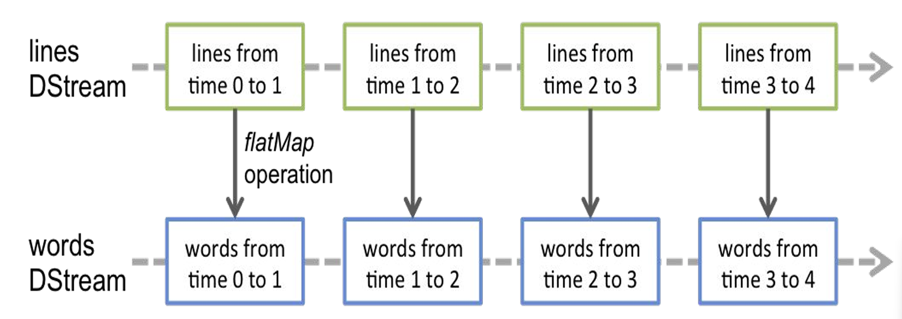
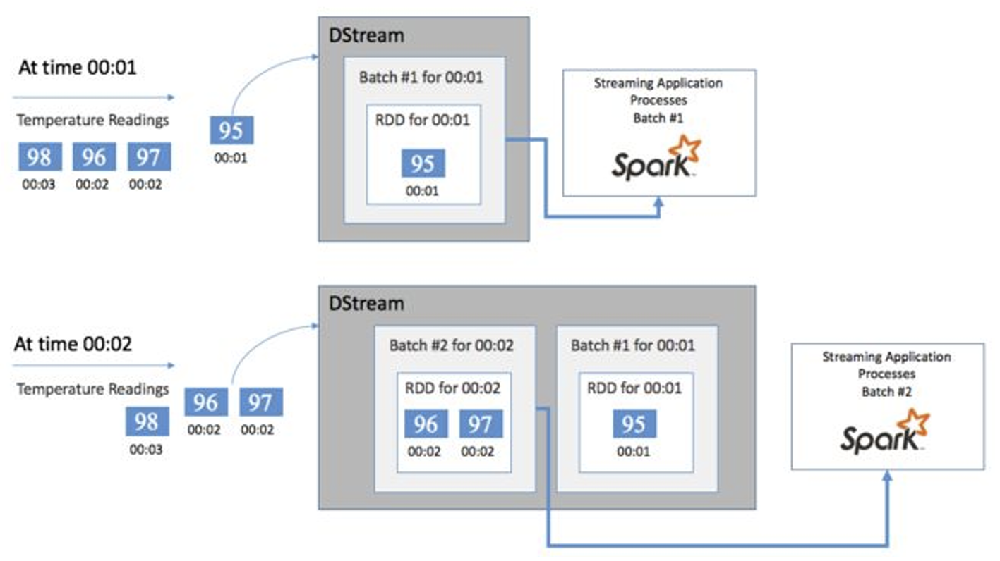
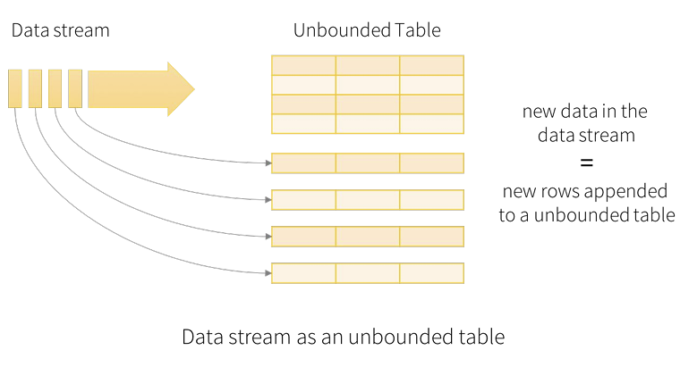

# Spark Streaming
- [Spark Streaming](#spark-streaming)
  - [Introduction to Spark Streaming](#introduction-to-spark-streaming)
    - [Key Drivers of Real-Time Processing](#key-drivers-of-real-time-processing)
    - [Benefits of Real-Time Processing](#benefits-of-real-time-processing)
    - [Drawbacks of Real-Time Processing](#drawbacks-of-real-time-processing)
    - [Use cases Across Industries](#use-cases-across-industries)
    - [Introduction to Spark Streaming](#introduction-to-spark-streaming-1)
  - [DStreams](#dstreams)
    - [Discretized Streams (DStreams)](#discretized-streams-dstreams)
    - [Receivers](#receivers)
      - [Basic Sources](#basic-sources)
      - [Advanced Sources](#advanced-sources)
    - [Sharing Code Between Batch and Streaming](#sharing-code-between-batch-and-streaming)
    - [Use Cases](#use-cases)
      - [DStreams Joins with Static Data](#dstreams-joins-with-static-data)
      - [Stream - Stream Join](#stream---stream-join)
      - [DStreams Application: Word Count](#dstreams-application-word-count)
  - [Structured Streaming](#structured-streaming)
    - [DStreams vs Structured Streaming](#dstreams-vs-structured-streaming)
  - [Windowing and Watermarking](#windowing-and-watermarking)
    - [Windowing](#windowing)
      - [Types of Windowing](#types-of-windowing)
      - [Windowing Examples](#windowing-examples)
    - [Watermarking](#watermarking)
      - [Watermarking Example](#watermarking-example)
      - [Late Elements](#late-elements)
      - [Types of Elements](#types-of-elements)
      - [Types of Watermarks](#types-of-watermarks)
    - [Output Modes](#output-modes)
      - [Complete Mode Example](#complete-mode-example)
      - [Update Mode Example](#update-mode-example)
      - [Append Mode Example](#append-mode-example)
    - [Triggers](#triggers)
      - [Trigger types](#trigger-types)
      - [Available Now Trigger](#available-now-trigger)


---


## Introduction to Spark Streaming
### Key Drivers of Real-Time Processing

- **The exponential growth of data**: The amount of data being generated is growing at an unprecedented rate. Traditional batch processing methods are simply not fast enough to keep up with this growth.

- **The need for immediate insights**: Businesses need to be able to understand their data in real time to make timely decisions. For example, a retail store may need to know which products are selling well in real time so that they can adjust their inventory levels accordingly.

- **The rise of the Internet of Things (IoT)**: The IoT is creating a new wave of data from connected devices. This data can be used to improve a wide range of applications, such as predictive maintenance and fraud detection.


### Benefits of Real-Time Processing

- **Improved decision-making**: Real-time processing provides organizations with the insights they need to make informed decisions quickly.

- **Increased efficiency**: Real-time processing can help organizations optimize their operations and improve efficiency.

- **Enhanced customer experience**: Real-time processing can be used to personalize the customer experience and improve customer satisfaction.

- **Reduced risk**: Real-time processing can be used to identify and prevent problems before they occur.

- **Critical systems**: Ensures the safety and reliability of critical systems like aviation control, automotive safety systems, and industrial control systems.

- **Regulatory compliance**: Helps organizations meet strict regulatory requirements by ensuring that data is processed and actions are taken in a timely manner.


### Drawbacks of Real-Time Processing

- **Complexity and cost**: Real-time processing systems can be complex and expensive to develop and maintain. They require high-performance hardware and software, as well as specialized skills to operate.

- **Data overload**: Real-time systems can be overwhelmed by large volumes of data, which can lead to delays and inaccuracies in processing.

- **Limited historical analysis**: Because real-time processing focuses on the present, it can be difficult to identify long-term trends and patterns in data. This can make it challenging to make strategic decisions based on historical data.

### Use cases Across Industries
- **Credit**: identify fraudulent transactions as soon as they occur.
- **Transportation**: dynamic re-routing of traffic or vehicle feet.
- **Retail**: dynamic inventory management, real-time in-store offers and recommendations.
- **Consumer Mobile**: optimize user engagement based on user's behaviour.
- **Healthcare**: continuously monitor patient vital stats and proactively identify at-risk patients.
- **Manufacturing**: identify equipment failures and react instantly. Perform proactive maintenance.
- **Surveillance**: identify threats and intrusions in real-time.
- **Digital Advertising & Marketing**: optimize and personalize content based on real-time information.

### Introduction to Spark Streaming

Spark libraries: There are a multitude of libraries for every purpose. The stack is unified.


The stack is also unified for data sources:


**Unified stack**: All Spark libraries and components are designed to work together consistently and efficiently within the same environment. This means that you can use various Spark libraries in an integrated way without having to switch environments or deal with compatibility issues.

**Spark Streaming** provides a scalable, fault-tolerant, and efficient way of processing streaming data using Spark’s simple programming model. It converts streaming data into "micro-batches," which enable Spark’s batch programming model to be applied in streaming use cases. This unified programming model makes it easy to combine batch and interactive data processing with streaming.

- **Runs as a Spark job**
- **Deployment options**: Kubernetes, Cloud, etc.
- **Unified codebase**: Use the same code for real-time Spark Streaming and batch Spark jobs.
- **Native integration**: Integrates natively with messaging systems such as Flume, Kafka, ZeroMQ, etc.
- **Customizability**: Easy to write “Receivers” for custom messaging systems.

## DStreams

### Discretized Streams (DStreams)

Spark Streaming is a separate library designed to efficiently process continuously flowing streaming data. It provides the DStream API, which is powered by Spark RDDs, to offer a robust framework for real-time data analysis. A key feature of Spark Streaming is its use of microbatching, which allows incoming data to be processed in small batches.

**Key Concepts**
- **Incoming Data Represented as Discretized Streams (DStreams)**: In Spark Streaming, continuous data streams are represented as DStreams. Each DStream is a continuous sequence of data. Contains Micro-batches.

- **Stream is Broken Down into Micro-batches**: The continuous data stream is divided into small batches known as micro-batches. This allows data to be processed at regular intervals, making it easier to handle large volumes of real-time data.

- **Each RDD in a DStream Contains Data from a Certain Interval**: Within a DStream, each Resilient Distributed Dataset (RDD) includes the data received during a specific time interval. This ensures that data is processed in an organized and consistent manner. See the following figure for more details:
  
- Each micro-batch is an RDD, allowing code to be shared between batch and streaming operations.
- Any operation applied on a DStream translates to operations on the underlying RDDs.
  



### Receivers

Receivers are special objects in Spark Streaming designed to consume data from various data sources and move it into Spark for processing. They play a crucial role in the data ingestion process within the Spark Streaming framework.

**Key Characteristics of Receivers**

- **Data Consumption**: Receivers are responsible for continuously consuming data from external data sources, such as Kafka, Flume, or socket connections. Once the data is consumed, it is passed into Spark for further processing and analysis.

- **Creation and Execution**: Receivers are created by the streaming context and are executed as long-running tasks on different executors within a Spark cluster. This distribution across executors ensures efficient data ingestion and parallel processing.

- **Resource Allocation**: Each receiver requires one core to operate. This means that for every receiver running, one core of the cluster's CPU resources is allocated to handle the data ingestion task.


#### Basic Sources

- **TCP Sockets**: Reads text data from a TCP socket connection. The below code creates a DStream that connects to `localhost` on port `9999` and reads text data sent to this socket.

  ```scala
  val lines = ssc.socketTextStream("localhost", 9999)
  ```

- **File Stream**: Monitors a directory for new text files and reads their content. The below code creates a DStream that monitors `dataDirectory` and reads any new text files added to this directory.

  ```scala
  streamingContext.textFileStream(dataDirectory)
  ```

- **Akka actor based Stream**: Uses Akka actors to receive streaming data. The below code creates a DStream that receives data from an Akka actor specified by `actorProps` and `actorName`.

  ```scala
  streamingContext.actorStream(actorProps, actorName)
  ```

- **RDDs queue based Stream**: Consumes data from a queue of pre-existing RDDs. The below code creates a DStream that processes RDDs from the provided `queueOfRDDs`. This is useful for testing and simulating streams.
  ```scala
  streamingContext.queueStream(queueOfRDDs)
  ```

#### Advanced Sources

Advanced Sources are used for ingesting data from sources like Kafka, Flume, and Kinesis that are not present in the Spark Streaming core API.

You will have to add the corresponding artifact `spark-streaming-xyz_2.11` to the dependencies. For example, some of the common ones are as follows:

| Source  | Artifact                            |
|---------|-------------------------------------|
| Kafka   | spark-streaming-kafka-0-8_2.11           |
| Flume   | spark-streaming-flume_2.11           |
| Kinesis | spark-streaming-kinesis-asl_2.11 [Amazon Software License] |


### Sharing Code Between Batch and Streaming

Spark allows you to reuse code seamlessly between batch processing and streaming applications. 

- In Spark Streaming, data is processed in small batches called micro-batches. These micro-batches are converted into Resilient Distributed Datasets (RDDs) at regular intervals (e.g., every few seconds).
- Each RDD represents a batch of data collected during a specific time interval from the streaming data source.
- Spark provides a unified programming model where the same operations and transformations that are applied to RDDs in batch processing can also be applied to RDDs in streaming processing. This allows you to reuse existing batch processing logic in streaming applications without major modifications.

**Example: Filtering "ERRORS"**

- The provided Scala function `filterErrors` demonstrates code that filters out lines containing the string "ERROR" from an RDD of strings.
- This function can be used interchangeably in both batch and streaming contexts because it operates on RDDs, which are the fundamental data abstraction in Spark.
- Here’s the example code:
  
  ```scala
  def filterErrors(rdd: RDD[String]): RDD[String] = {
      rdd.filter(s => s.contains("ERROR"))
  }
  ```


### Use Cases
#### DStreams Joins with Static Data

This code sets up a Spark Streaming application that consumes data from Kafka, processes it by joining the stream with a static RDD, and prints the joined results. It demonstrates the integration of Spark Streaming with Kafka and showcases how to reuse RDD-based operations within a streaming context.

As for the join operation:

- It showcases how to perform a join operation between the transformed stream RDD (`transformedRDD`) and a static RDD (`staticRDD`).

```python
from pyspark import SparkContext
from pyspark.streaming import StreamingContext
from pyspark.streaming.kafka import KafkaUtils

# Initialize SparkContext and StreamingContext with a 1-second batch interval
sc = SparkContext(appName="KafkaSparkStreaming")
ssc = StreamingContext(sc, 1) # 1-second batch interval

# Kafka configuration and creating a direct stream
kafkaParams = {"metadata.broker.list": "localhost:9092"}
kafkaStream = KafkaUtils.createDirectStream(ssc, ["your_kafka_topic"], kafkaParams)

# Define your static RDD here
staticData = [("key1", "value1"), ("key2", "value2"), ("key3", "value3")]
staticRDD = sc.parallelize(staticData) # converts staticData into a resilient distributed dataset (RDD) staticRDD

# Function to process each RDD within the DStream
def process (time, rdd):
  if not rdd.isEmpty():
    # Assuming Kafka sends key-value pairs, map them appropriately
    transformedRDD = rdd.map(lambda x: (x[0], x[1]))
    # Join the transformed stream RDD with the static RDD
    joinedRDD = transformedRDD.join(staticRDD)
    print("Joined results at %s" % str(time))
    joinedRDD.foreach(print)

# For each RDD in the DStream, apply the processing function
kafkaStream.foreachRDD(process)

# Start the streaming computation and await termination
ssc.start()
ssc.awaitTermination()
```


#### Stream - Stream Join

Graphical representation of the Join:


The below Python code sets up a Spark Streaming application that integrates with Kafka to process data from two topics: "impressions" and "visits". 
- It initializes a SparkContext (`sc`) and a StreamingContext (`ssc`) with a batch interval of 1 second. 
- Using KafkaUtils, it creates direct streams (`impressionsStream` and `visitsStream`) for each topic, configuring them with Kafka parameters (`metadata.broker.list: localhost:9092`). 
- A transformation function (`transformRDD`) is defined to map each RDD in the streams to key-value pairs, assuming Kafka sends data in that format. This transformation is applied to both streams (`transformedImpressions` and `transformedVisits`).
- The transformed streams are then joined (`joinedStreams`) based on their keys. 
- A processing function (`processJoinedStream`) is defined to print the joined results for each time interval where data is available. 
- Finally, the streaming computation is started (`ssc.start()`) and the application awaits termination (`ssc.awaitTermination()`), effectively continuously processing and joining data from the Kafka topics in near real-time.

As for the join operation:
- It showcases how to perform a join (`joinedStreams = transformedImpressions.join(transformedVisits)`) between the transformed streams (`transformedImpressions` and `transformedVisits`).


```python
from pyspark import SparkContext
from pyspark.streaming import StreamingContext
from pyspark.streaming.kafka import KafkaUtils

# Initialize SparkContext and StreamingContext with a 1-second batch interval
sc = SparkContext(appName="KafkaSparkStreaming")
ssc = StreamingContext(sc, 1) # 1-second batch interval

# Kafka configuration
kafkaParams = {"metadata.broker.list": "localhost:9092"}

# Creating direct streams for both topics
impressionsStream = KafkaUtils.createDirectStream(ssc, ["impressions"], kafkaParams)
visitsStream = KafkaUtils.createDirectStream(ssc, ["visits"], kafkaParams)

# Function to transform each RDD from the stream
def transformRDD(rdd):
  # Assuming Kafka sends key-value pairs, e.g., user ID as the key
  return rdd.map(lambda x: (x[0], x[1]))

# Apply the transformation to both streams
transformedImpressions = impressionsStream.transform(transformRDD)
transformedVisits = visitsStream.transform(transformRDD)

# Join the streams
joinedStreams = transformedImpressions.join(transformedVisits)

# Process the joined streams
def processJoinedStream(time, rdd):
  if not rdd.isEmpty():
    print("Joined results at %s" % str(time))
    rdd.foreach(print)

joinedStreams.foreachRDD(processJoinedStream)

# Start the streaming computation and await termination
ssc.start()
ssc.awaitTermination()
```


#### DStreams Application: Word Count

This Python code sets up a Spark Streaming application that reads text files from a directory (`'./streamingData'`) in near real-time. 
- It initializes a SparkContext (`sc`) and a StreamingContext (`ssc`) with a batch interval of 2 seconds.
- After configuring to quiet Spark logs, it creates a DStream (`lines`) that monitors the specified directory for new text files. 
- The lines are then split into words (`words`) and counted (`wordCounts`) in each batch. 
- The results of these word counts are printed to the console (`wordCounts.pprint()`). 
- Finally, it starts the streaming computation (`ssc.start()`) and waits for it to terminate (`ssc.awaitTermination()`), enabling continuous processing of data from the specified directory in a streaming fashion.

```python
"""
To run ./pyspark.submit.sh spark-streaming-foreachRDD-and-foreachPartition.py
"""

from pyspark import SparkContext, SparkConf
from pyspark.streaming import StreamingContext

from quiet_logs import quiet_logs

if __name__ == "__main__":
  conf = SparkConf().setAppName("Reading files from a directory")
  sc   = SparkContext(conf=conf)
  ssc  = StreamingContext(sc, 2)

  quiet_logs(sc)

  lines = ssc.textFileStream('./streamingData')

  # Split each line into words
  words = lines.flatMap(lambda line: line.split(" "))

  # Count each word in each batch
  pairs = word.map(lambda word: (word, 1))

  wordCounts = pairs.reduceByKey(lambda x, y: x + y)

  # Print the first ten elements of each RDD generated in this DStream to the console
  wordCounts.pprint()

  ssc.start() # Start the computation
  ssc.awaitTermination() # Wait for the computation to terminate
```

## Structured Streaming

Structured Streaming is a high-level API for stream processing that became production-ready in Spark 2.2. It is scalable and fault-tolerant, and it is built on the Spark SQL engine. Structured Streaming allows you to take the same operations that you perform in batch mode using Spark’s structured APIs, and run them in a streaming fashion. This can reduce latency and allow for incremental processing. For more information, visit [Databricks - Structured Streaming](https://www.databricks.com/glossary/what-is-structured-streaming).

### DStreams vs Structured Streaming

DStreams handles data as discrete RDDs, suitable for low-level operations but prone to complexity and performance issues. In contrast, Structured Streaming, built on Spark SQL, offers memory optimizations and uses DataFrame and Dataset APIs for more intuitive and efficient stream processing. It supports SQL queries and Scala operations directly on streaming data, ensuring exact-once delivery and low latency (100 milliseconds or less). 


Micro-batching is used in both Structured Streaming and Streaming with DStreams. 

The greatest distinction is in the latency and message delivery guarantees: while Streaming with DStreams merely ensures that messages are sent at least once, on the other hand Structured Streaming enables exact-once delivery with latencies of 100 milliseconds or less.

See more information on: [LinkedIn - Spark Streaming or Structured Streaming?](https://www.linkedin.com/pulse/spark-streaming-structured-anshuman-varshney/).



Note: A new row is added to the input table for each data item that enters the stream, which finally changes the result table. The modified result rows are written to an external sink each time the result table is updated.

## Windowing and Watermarking
### Windowing

**Windowing** is a powerful feature in Apache Spark that allows for set-based computations (such as aggregations) or other operations over subsets of events within a specified time period. This is particularly useful for processing time-series data, streaming data, and real-time analytics, where operations need to be performed over a continuous stream of data points.

#### Types of Windowing

1. **Fixed Window/Tumbling Window**:
   - Divides the data stream into non-overlapping, contiguous time intervals of a specified length. Each event belongs to exactly one window, and the windows "tumble" over the data without overlap.
   - Example: If the window size is 1 minute, then events are grouped into 1-minute intervals starting from the epoch.

2. **Sliding Window**:
   - Allows for overlapping windows. It divides the data stream into overlapping time intervals, which slide over the data at a specified interval. This means an event can belong to multiple windows.
   - Example: With a window size of 1 minute and a slide interval of 30 seconds, a new window starts every 30 seconds, and each window covers the next 1-minute period.

3. **Session Window**:
   - Groups events that are separated by periods of inactivity (gaps) within a specified timeout. Each window represents a session of activity followed by a period of inactivity.
   - Example: If the session timeout is set to 10 minutes, any events occurring within 10 minutes of the last event are grouped into the same session.

#### Windowing Examples

**Example 1: Code for Fixed Window**

Here's an example of how to use windowing in Spark to perform a count aggregation over a 1-minute fixed window:

```python
from pyspark.sql.functions import window

# Assuming `df` is a DataFrame with a timestamp column named "timestampColumn"
df.withWatermark("timestampColumn", "5 hours")  # Setting a watermark to handle late data
  .groupBy(window("timestampColumn", "1 minute"))  # Grouping by 1-minute windows
  .count()  # Aggregating the count of events in each window
```
- `withWatermark("timestampColumn", "5 hours")`: This sets a watermark on the `timestampColumn` with a 5-hour threshold. Watermarking is used to handle late-arriving data by specifying how late data can be before it is considered too late for processing.
- `groupBy(window("timestampColumn", "1 minute"))`: This groups the data into 1-minute fixed windows based on the `timestampColumn`. Each window captures events that fall within a 1-minute interval.
- `count()`: This performs a count aggregation over each 1-minute window, resulting in the number of events in each window.


In the below image we have two additional examples.

**Example 2: Mapping of event-time to 5 minutes tumbling windows.**

This example demonstrates how to group events into non-overlapping, fixed windows of 5 minutes each, known as tumbling windows.

```python
from pyspark.sql.functions import *

# Assuming `eventsDF` is a DataFrame with a timestamp column named "eventTime"
windowedAvgSignalDF = \
  eventsDF \
    .groupBy(window("eventTime", "5 minute")) \
    .count()
```
- `groupBy(window("eventTime", "5 minute"))`: This line groups the events in `eventsDF` into 5-minute windows based on the `eventTime` column. The `window` function creates fixed windows of 5 minutes.
  - For example, if an event occurs at 12:03, it will fall into the 12:00-12:05 window.
  - Events are divided into contiguous intervals of 5 minutes, with no overlap.
- `count()`: This aggregates the count of events in each 5-minute window.


**Example 3: Mapping of event-time to overlapping windows of length 10 minutes and sliding interval 5 minutes.**

This example shows how to group events into overlapping windows of 10 minutes each, with each window starting every 5 minutes.

```python
from pyspark.sql.functions import *

# Assuming `eventsDF` is a DataFrame with a timestamp column named "eventTime"
windowedAvgSignalDF = \
  eventsDF \
    .groupBy(window("eventTime", "10 minutes", "5 minutes")) \
    .count()
```
- `groupBy(window("eventTime", "10 minutes", "5 minutes"))`: This line groups the events in `eventsDF` into overlapping windows of 10 minutes each, with a new window starting every 5 minutes. The `window` function creates these overlapping windows.
  - For example, if an event occurs at 12:03, it will fall into the windows 12:00-12:10 and 12:05-12:15. This means an event can belong to multiple overlapping windows.
- `count()`: This aggregates the count of events in each 10-minute window.


### Watermarking
**Watermarking** is a crucial concept in stream processing that allows for handling late-arriving data efficiently. In Spark, watermarking is a moving threshold in event-time that trails behind the maximum event-time seen by the query in the processed data. This means that Spark keeps track of the latest event-time seen and allows for late data to be included in the computation up to a certain point, defined by the watermark.


#### Watermarking Example

**Late data handling in Windowed Grouped Aggregation.**

This example demonstrates how late-arriving data can be incorporated into the results even if it arrives after the initial processing window. 


Scenario Explanation:

1. **Stream Input Data**: We have a stream of events with timestamps. Each event represents some activity at a specific time. Example: (12:02, dev1) means that device # 1 signal was received at 12:02.

2. **Window Specifications**:
   - The windows have a duration of 10 minutes.
   - These windows overlap every 5 minutes, meaning a new window starts every 5 minutes and covers the next 10 minutes.

3. **Late Data Arrival**: Consider an event with the timestamp `12:04` from device `dev2` (marked in red in the image above).
   - This event arrives late, specifically at `12:11`.
   - Despite arriving late, Spark can still incorporate this late event into the appropriate windows using watermarking. Spark keeps track of the maximum event time seen and allows late data to be included if it arrives within the watermark threshold (10 minutes in this case).
   - Note that without watermarking, this event would be discarded if the window for `12:04` has already been processed.


Detailed code example for the example above:

```python
from pyspark.sql.functions import window, col

# Assuming `eventsDF` is a DataFrame with a timestamp column named "eventTime"
windowedAvgSignalDF = (
    eventsDF
    .withWatermark("eventTime", "10 minutes")  # Setting a watermark to handle late data
    .groupBy(window("eventTime", "10 minutes", "5 minutes"), col("device"))  # Grouping by 10-minute overlapping windows and device
    .count()  # Aggregating the count of events in each window
)
```

#### Late Elements

In stream processing, some elements may arrive after the expected time, potentially violating the watermark condition. When late elements occur:

**Violation of Watermark Condition**: If the watermark is at time \( t \), and this time is already past, any new elements with a timestamp \( t' \) less than or equal to \( t \) are considered late and violate the watermark condition.

**Strategies for Handling Late Elements**
1. **Dropping Late Elements**:
   - Late elements are dropped if they arrive after the watermark has moved past the end of the window.
   - This ensures that excessively late data does not affect the results.

2. **Allowing Late Elements with Maximum Allowed Lateness**:
   - Spark can be configured to allow a certain amount of lateness for window operations.
   - Elements that arrive after the watermark has passed the end of the window, but before it has passed the end of the window plus the allowed lateness, are still included in the window.
   - These elements can still contribute to the window’s computation even though they are late. Two ways to do so:

     - **Re-firing Windows**: If a late but not dropped element arrives, it can cause the window to trigger (or fire) again. This allows for updates to the window’s results to incorporate the late data.

     - **Maintaining Window State**: The state of the windows is kept until the allowed lateness period expires. This ensures that any late elements arriving within this period are processed and the window’s results are updated accordingly once the period expires.

#### Types of Elements
- **Early elements**: the event time is the same as or close to the processing time. These elements arrive almost immediately after they are generated. They are processed with minimal delay.
- **On-time elements**: arrive within the expected window of processing time, relative to their event time. These elements are neither too early nor too late. They arrive and are processed within the expected latency.
- **Late elements**: arrive significantly after their event time, potentially after the processing window has moved on. May violate the watermark condition. Handling late elements requires special strategies to ensure accurate processing without excessive delays.

#### Types of Watermarks
- **Perfect Watermark**: accurately reflects the maximum event time that has been observed in the data stream.
  - Ensures that no late data is missed.
  - Requires complete and accurate knowledge of event times.
  - Use Case: Ideal in controlled environments where all event times can be precisely tracked.

- **Heuristic Watermark**: is based on approximations and rules of thumb rather than precise calculations.
  - It provides a best-effort estimate of the maximum event time.
  - Allows for some flexibility and error tolerance.
  - Use Case: Commonly used in real-world scenarios where perfect knowledge of event times is not feasible. Heuristic watermarks balance between timeliness and accuracy.

Perfect watermarks are used when precise event time tracking is possible and critical, while heuristic watermarks provide flexibility and practicality in more unpredictable and real-world scenarios. By choosing the appropriate watermark strategy, stream processing systems can ensure accurate, timely, and efficient data analysis.


### Output Modes

- **Complete Mode**: The entire updated Result Table will be written to the external storage.
  - Use case: it is useful for scenarios requiring comprehensive and updated results for each window.

- **Update Mode**: Only rows that were updated in the Result Table since the last trigger will be written to the external storage (available since Spark 2.1.1).
  - Use case: it is suitable for applications where only incremental changes need to be outputted.
  
- **Append Mode**: Only new rows appended in the Result Table since the last trigger will be written to the external storage.
  - Use case: it is effective for scenarios where the goal is to accumulate and maintain a history of results over time.
  
Note: Not all output modes are feasible with all queries; [check](https://spark.apache.org/docs/latest/structured-streaming-programming-guide.html#output-modes) here for more information.


#### Complete Mode Example

Watermarking in Windowed Grouped Aggregation

Complete Mode: Outputs the complete and updated result for each window after each computation cycle.


Late data arriving within the watermark threshold is included in the window’s aggregation: We see that table is updated with late data (such as `12:17, dev3`) but not updated with too late data (such as `12:04, dev1`).


#### Update Mode Example

Update Mode: Outputs only the updated results whenever there is a change due to new data.

In Update mode, only the updated results of the aggregation are outputted whenever there is a change in the result due to new data. The result table reflects incremental changes in the aggregation results as new data arrives.


#### Append Mode Example

Append Mode: Appends new results or rows to the result table without modifying existing results.

In Append mode, only new results or rows that have not been seen before are added to the result table. The result table grows with new results without modifying or updating existing results.


### Triggers

**Triggers** determine when the system should process the data within defined windows or intervals. 

#### Trigger types
The choice of trigger depends on the below characteristics:

|  Characteristics             | Default              | Once                  | Processing Time           | Continuous          |
|-------------------------|----------------------|-----------------------|---------------------------|---------------------|
| Processing Interval     | ASAP in seconds      | Only once             | Custom in seconds         | ASAP in milliseconds|
| Task type               | Periodic             | Once                  | Periodic                  | Long running        |
| Latency                 | Low (seconds)        | Batch                 | Custom (Seconds)          | Very Low (Milliseconds)|
| Throughput              | Medium               | High                  | Medium/High               | Low                 |
| Commit type             | Synchronous          | Synchronous           | Synchronous               | Asynchronous        |
| Write Ahead Log (Commit)| Before               | Before                | Before                    | After               |
| Supported Semantics     | All                  | All                   | All                       | At least Once       |
| Epoch markers           | Not Used             | Not Used              | Not Used                  | Used                |


#### Available Now Trigger

- **Available now**: New trigger introduced in Spark 3.3.0 to enhance the flexibility and scalability of processing data streams.
- **Execution Characteristics:** The **"Available Now"** trigger differs from traditional triggers like **"Once"** in how it handles data processing:
     - **Once**: Processes all available data in a single batch when triggered. → Scalability issues.
     - **Available Now**: Processes all available data at the moment of the query execution in multiple batches, dividing the workload to enhance scalability.

By breaking down the data processing into smaller batches, the "Available Now" trigger improves scalability. It allows Spark to handle large volumes of data more efficiently by spreading the workload across batches.

