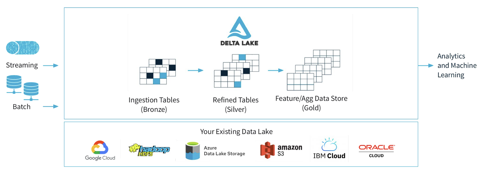
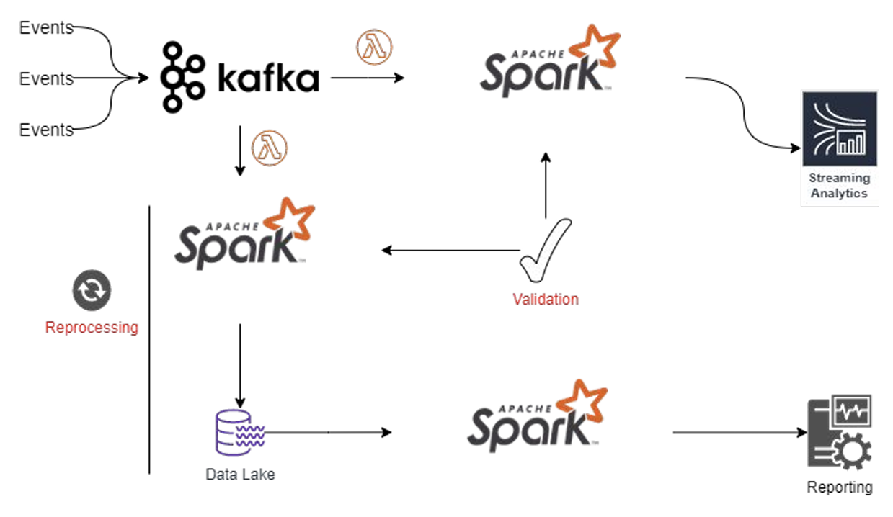
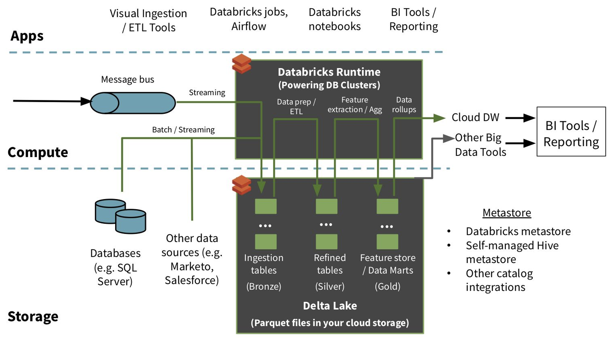
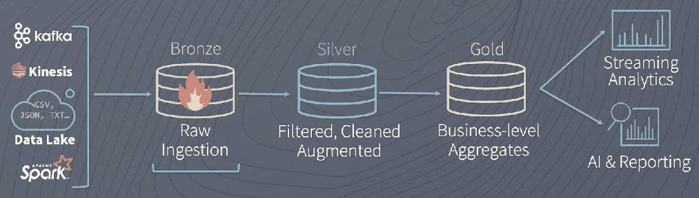
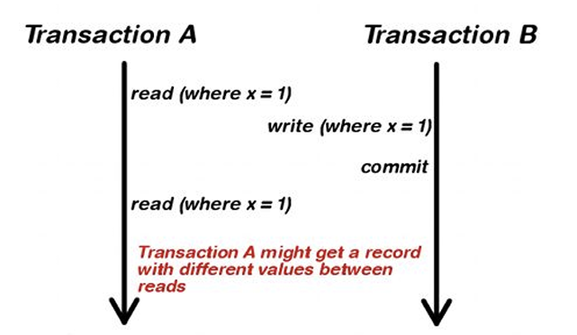

# Delta Lake

- [Delta Lake](#delta-lake)
  - [What is Delta Lake?](#what-is-delta-lake)
  - [Challenges of Delta Lake](#challenges-of-delta-lake)
  - [Architecture](#architecture)
    - [Key Features](#key-features)
      - [Transaction Log](#transaction-log)
      - [ACID Transactions](#acid-transactions)
      - [Solving Conflicts](#solving-conflicts)


## What is Delta Lake?

**Delta Lake** is an open-source storage layer that brings ACID transactions to Apache Spark and big data workloads. Delta Lake runs on top of your existing data lake.

It includes **Delta Engine**, which provides optimized layouts and indexes for fast interactive queries.



## Challenges of Delta Lake


Delta Lake presents several challenges across its architecture, validation, reprocessing, and updates:

1. **Architecture**:
   - **Scalable ACID Transactions**: Implementing distributed transactions at scale requires efficient coordination between compute and storage layers.
   - **Metadata Management**: Handling metadata for schema evolution, versioning, and transaction history poses challenges in scalability and performance.

2. **Validation**:
   - **Schema Evolution and Validation**: Ensuring schema enforcement and managing schema changes while maintaining backward compatibility is crucial for data consistency.
   - **Data Quality and Consistency**: Maintaining data quality and consistency across various data processing stages is challenging due to distributed data processing and potential anomalies.

3. **Reprocessing**:
   - **Backfilling and Historical Data**: Reprocessing historical data and handling late-arriving data requires managing data integrity and ensuring consistency across different data versions.

4. **Updates**:
   - **Upserts and Data Updates**: Efficiently managing upserts and updates while ensuring transactional integrity and conflict resolution is essential.
   - **Delta Lake Compaction and Optimization**: Optimizing storage and query performance while managing multiple versions of data files through compaction and optimization strategies.


## Architecture

Delta Lake has three stages of Data enrichment.

- **Bronze Tables**: contain the raw data ingested from various sources like json files, data from RDBMS systems, IoT data etc.

- **Silver Tables**: provide more refined view of the Bronze data.

- **Gold Tables**: provides business level aggregates often used for reporting and dash boarding.

Find more information [here](https://binilg.medium.com/explaining-databricks-delta-lake-a2abc008e7a6).





### Key Features

#### Transaction Log


- **Transaction Log**: is an ordered record of every transaction (SST - Sorted String Table).
  - **Update Mechanism**: Spark checks the transaction log to identify new transactions and updates the table accordingly.
  - **Atomic Commits**: Each change in the table is recorded as an ordered, atomic commit in the transaction log. Atomicity ensures that if a transaction isn't recorded in the transaction log, it never happened.
  - **Automatically Created**: in the `_delta_log` subdirectory.
  - **JSON Format**: Each commit is written out as a JSON file, ensuring a readable and structured format for transaction records.


#### ACID Transactions

- **Atomicity**: Either all changes take place, or none, ensuring the system is never in a halfway state. Furthermore, if a transaction isn't recorded in the transaction log, it is as if it never happened.
  - How Spark Fails to Ensure Atomicity Without Delta Tables: Without Delta tables, Spark operations can fail to maintain atomicity, leading to potential data inconsistencies. Consider the following example:
    - If a failure occurs at Line 4, where the old data has been removed but the new data hasn't been written yet, it results in data loss. This situation leaves the system in an inconsistent state, violating the principle of atomicity.
      ```python
      # Read from HDFS
      df = spark.read.parquet("/path/on/hdfs") # Line 1
      # Remove duplicates
      df = df.distinct() # Line 2
      # Overwrite the data
      df.cache() # Line 3 caches the data to improve performance 
      df.write.parquet("/path/on/hdfs", mode="overwrite") # Line 4
      ```
  - Benefits of Using Delta Tables for Atomicity:
    - **Concurrent Writes Handling**: Delta tables allow multiple writers from different clusters to simultaneously modify a table partition. They maintain a consistent snapshot view of the table with a serial order for these writes, ensuring data integrity even in concurrent environments.
    - **Consistent Reads During Writes**: Readers can continue to see a consistent snapshot view of the table, even when modifications are occurring. This is crucial for ensuring that data consumers always have a reliable view of the data, unaffected by ongoing write operations.


- **Consistency**: Data must always be consistent and valid in the system. Consistency guarantees that data remains in a valid state before and after the transaction.
  - How Spark Fails to Ensure Consistency Without Delta Tables: Considering the example seen in "atomicity" section, if a failure occurs at line 4, data will be inconsistent.


- **Isolation**: Transactions are isolated from each other, ensuring concurrent transactions do not interfere. Multiple transactions occur in isolation.
  - Consider two jobs running in parallel, one as described above and another which is also using the same dataset. If one job overwrites the dataset while the other is still using it, failure might happen, and isolation fails.
  


- **Durability**: Once a transaction is committed, it remains so, even in the event of a system crash. Changes once made are never lost, even in the case of system failure.
  - Spark doesn’t significantly affect durability; it is mainly governed by the storage level (AWS S3, Google Cloud Storage, Azure Blob Storage, Hadoop HDFS).

#### Solving Conflicts

- **Solving Conflicts Optimistically**: Assumes that multiple transactions (changes) made to a table by different users can complete without conflicting with one another. If conflicts occur, it raises an error.
- Writes in optimistic concurrency control operate in **three stages**:
  - **Read**: (if needed) the latest version of the table to identify which files need to be modified (rewritten).
  - **Write**: Stage all the changes by writing new data files.
  - **Validate and Commit**: Before committing the changes, checks whether the proposed changes conflict with any other changes that may have been concurrently committed since the snapshot that was read. If there are conflicts, the write operation fails.

- **Write Conflicts**: The table below illustrates how different write operations can conflict in Delta Lake, depending on the isolation level.
  - `Serializable` isolation is the strictest isolation level, ensuring complete isolation of transactions. It provides the highest level of consistency but can lead to more conflicts. 
  - `WriteSerializable` is a less strict isolation level, allowing certain concurrent writes without conflicts as long as specific conditions are met. It allows for more concurrency with specific conditions to avoid conflicts.

|  | **INSERT (1)** | **UPDATE, DELETE, MERGE INTO** | **OPTIMIZE** |
|---------------|------------|-------------------------------|--------------|
| **INSERT** | Cannot conflict |  |  |
| **UPDATE, DELETE, MERGE INTO** | Can conflict in Serializable, cannot conflict in WriteSerializable if it writes to the table without reading first. | Can conflict in Serializable and WriteSerializable. |  |
| **OPTIMIZE** | Cannot conflict | Can conflict in Serializable and WriteSerializable. | Can conflict in Serializable and WriteSerializabl. |


This SQL command sets the isolation level of a Delta Lake table to `Serializable`, ensuring the strictest level of transaction isolation:

```sql
ALTER TABLE <table-name> SET TBLPROPERTIES ('delta.isolationLevel' = 'Serializable')
```


