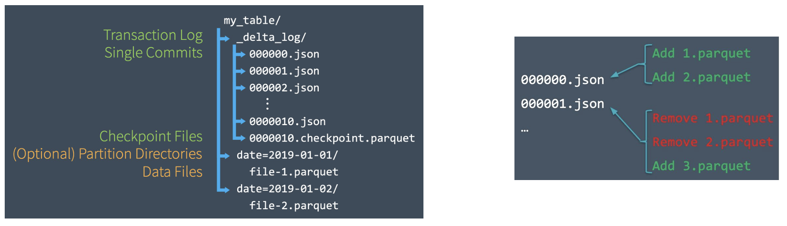
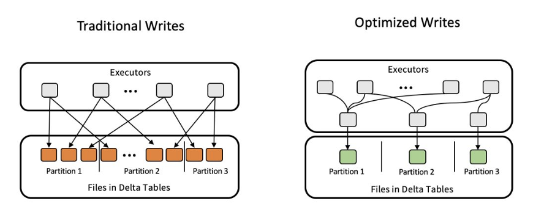
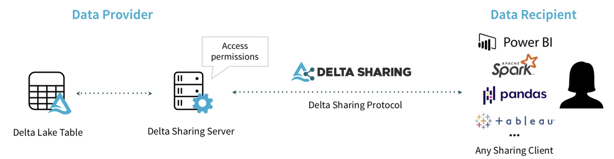

# Delta Lake

- [Delta Lake](#delta-lake)
  - [What is Delta Lake?](#what-is-delta-lake)
  - [Challenges of Delta Lake](#challenges-of-delta-lake)
  - [Architecture](#architecture)
    - [Key Features](#key-features)
      - [Transaction Log](#transaction-log)
      - [ACID Transactions](#acid-transactions)
      - [Solving Conflicts](#solving-conflicts)
    - [Time Travel](#time-travel)
    - [Table](#table)
      - [Create a Table](#create-a-table)
      - [Write a Table](#write-a-table)
    - [Views](#views)
    - [Schema Enforcement \& Evolution](#schema-enforcement--evolution)
    - [Constraints](#constraints)
    - [Upsert into a Table Using Merge](#upsert-into-a-table-using-merge)
  - [Change Data Feed (CDF)](#change-data-feed-cdf)
    - [Change Data Capture (CDC)](#change-data-capture-cdc)
    - [Change Data Feed (CDF)](#change-data-feed-cdf-1)
  - [Optimization](#optimization)
  - [Delta Lake Integrations](#delta-lake-integrations)
    - [Presto and Athena Integration](#presto-and-athena-integration)
    - [Other Integrations](#other-integrations)
    - [Delta Sharing](#delta-sharing)
    - [Delta Live Tables](#delta-live-tables)
  - [Lakehouse](#lakehouse)
  - [Delta Lake Future](#delta-lake-future)


## What is Delta Lake?

**Delta Lake** is an open-source storage layer that brings ACID transactions to Apache Spark and big data workloads. Delta Lake runs on top of your existing data lake.

It includes **Delta Engine**, which provides optimized layouts and indexes for fast interactive queries.


## Challenges of Delta Lake


Delta Lake presents several challenges across its architecture, validation, reprocessing, and updates:

1. **Architecture**:
   - **Scalable ACID Transactions**: Implementing distributed transactions at scale requires efficient coordination between compute and storage layers.
   - **Metadata Management**: Handling metadata for schema evolution, versioning, and transaction history poses challenges in scalability and performance.

2. **Validation**:
   - **Schema Evolution and Validation**: Ensuring schema enforcement and managing schema changes while maintaining backward compatibility is crucial for data consistency.
   - **Data Quality and Consistency**: Maintaining data quality and consistency across various data processing stages is challenging due to distributed data processing and potential anomalies.

3. **Reprocessing**:
   - **Backfilling and Historical Data**: Reprocessing historical data and handling late-arriving data requires managing data integrity and ensuring consistency across different data versions.

4. **Updates**:
   - **Upserts and Data Updates**: Efficiently managing upserts and updates while ensuring transactional integrity and conflict resolution is essential.
   - **Delta Lake Compaction and Optimization**: Optimizing storage and query performance while managing multiple versions of data files through compaction and optimization strategies.


## Architecture

Delta Lake has three stages of Data enrichment.

- **Bronze Tables**: contain the raw data ingested from various sources like json files, data from RDBMS systems, IoT data etc.

- **Silver Tables**: provide more refined view of the Bronze data.

- **Gold Tables**: provides business level aggregates often used for reporting and dash boarding.

Find more information [here](https://binilg.medium.com/explaining-databricks-delta-lake-a2abc008e7a6).


### Key Features

#### Transaction Log


- **Transaction Log**: is an ordered record of every transaction (SST - Sorted String Table).
  - **Update Mechanism**: Spark checks the transaction log to identify new transactions and updates the table accordingly.
  - **Atomic Commits**: Each change in the table is recorded as an ordered, atomic commit in the transaction log. Atomicity ensures that if a transaction isn't recorded in the transaction log, it never happened.
  - **Automatically Created**: in the `_delta_log` subdirectory.
  - **JSON Format**: Each commit is written out as a JSON file, ensuring a readable and structured format for transaction records.


#### ACID Transactions

- **Atomicity**: Either all changes take place, or none, ensuring the system is never in a halfway state. Furthermore, if a transaction isn't recorded in the transaction log, it is as if it never happened.
  - How Spark Fails to Ensure Atomicity Without Delta Tables: Without Delta tables, Spark operations can fail to maintain atomicity, leading to potential data inconsistencies. Consider the following example:
    - If a failure occurs at Line 4, where the old data has been removed but the new data hasn't been written yet, it results in data loss. This situation leaves the system in an inconsistent state, violating the principle of atomicity.
      ```python
      # Read from HDFS
      df = spark.read.parquet("/path/on/hdfs") # Line 1
      # Remove duplicates
      df = df.distinct() # Line 2
      # Overwrite the data
      df.cache() # Line 3 caches the data to improve performance 
      df.write.parquet("/path/on/hdfs", mode="overwrite") # Line 4
      ```
  - Benefits of Using Delta Tables for Atomicity:
    - **Concurrent Writes Handling**: Delta tables allow multiple writers from different clusters to simultaneously modify a table partition. They maintain a consistent snapshot view of the table with a serial order for these writes, ensuring data integrity even in concurrent environments.
    - **Consistent Reads During Writes**: Readers can continue to see a consistent snapshot view of the table, even when modifications are occurring. This is crucial for ensuring that data consumers always have a reliable view of the data, unaffected by ongoing write operations.




- **Consistency**: Data must always be consistent and valid in the system. Consistency guarantees that data remains in a valid state before and after the transaction.
  - How Spark Fails to Ensure Consistency Without Delta Tables: Considering the example seen in "atomicity" section, if a failure occurs at line 4, data will be inconsistent.


- **Isolation**: Transactions are isolated from each other, ensuring concurrent transactions do not interfere. Multiple transactions occur in isolation.
  - Consider two jobs running in parallel, one as described above and another which is also using the same dataset. If one job overwrites the dataset while the other is still using it, failure might happen, and isolation fails.
  


- **Durability**: Once a transaction is committed, it remains so, even in the event of a system crash. Changes once made are never lost, even in the case of system failure.
  - Spark doesn’t significantly affect durability; it is mainly governed by the storage level (AWS S3, Google Cloud Storage, Azure Blob Storage, Hadoop HDFS).

#### Solving Conflicts

- **Solving Conflicts Optimistically**: Assumes that multiple transactions (changes) made to a table by different users can complete without conflicting with one another. If conflicts occur, it raises an error.
- Writes in optimistic concurrency control operate in **three stages**:
  - **Read**: (if needed) the latest version of the table to identify which files need to be modified (rewritten).
  - **Write**: Stage all the changes by writing new data files.
  - **Validate and Commit**: Before committing the changes, checks whether the proposed changes conflict with any other changes that may have been concurrently committed since the snapshot that was read. If there are conflicts, the write operation fails.

- **Write Conflicts**: The table below illustrates how different write operations can conflict in Delta Lake, depending on the isolation level.
  - `Serializable` isolation is the strictest isolation level, ensuring complete isolation of transactions. It provides the highest level of consistency but can lead to more conflicts. 
  - `WriteSerializable` is a less strict isolation level, allowing certain concurrent writes without conflicts as long as specific conditions are met. It allows for more concurrency with specific conditions to avoid conflicts.

|  | **INSERT (1)** | **UPDATE, DELETE, MERGE INTO** | **OPTIMIZE** |
|---------------|------------|-------------------------------|--------------|
| **INSERT** | Cannot conflict |  |  |
| **UPDATE, DELETE, MERGE INTO** | Can conflict in Serializable, cannot conflict in WriteSerializable if it writes to the table without reading first. | Can conflict in Serializable and WriteSerializable. |  |
| **OPTIMIZE** | Cannot conflict | Can conflict in Serializable and WriteSerializable. | Can conflict in Serializable and WriteSerializabl. |


This SQL command sets the isolation level of a Delta Lake table to `Serializable`, ensuring the strictest level of transaction isolation:

```sql
ALTER TABLE <table-name> SET TBLPROPERTIES ('delta.isolationLevel' = 'Serializable')
```


### Time Travel

**Common Challenges with Changing Data**
- **Audit Data Changes**: Auditing data changes is essential for data compliance and debugging. It helps track how and when data has changed over time, which is critical for regulatory compliance and for understanding data transformations during debugging.
- **Reproduce Experiments & Reports**: Data scientists often run multiple experiments with different parameters on a specific dataset (model training stage). When revisiting these experiments to reproduce results or models, they often face challenges because the source data might have been modified by upstream processes, making it difficult to recreate the exact conditions of the original experiments.
- **Rollbacks**: Sometimes, data pipelines might introduce erroneous data due to infrastructure issues, bad data quality, or bugs in the pipeline. In such cases, it's important to roll back to a previous state of the data before the bad data was introduced to prevent downstream impacts.

**Solutions Provided by Delta Lake: Time Travel feature**

Delta Lake offers a robust solution to these challenges through its **Time Travel** feature, which allows you to access and query previous versions of your data. Here’s how it works:

- **Versioning**:
  - Delta Lake automatically versions every operation that writes data to a Delta table.
  - This means every insert, update, delete, and merge operation creates a new version of the table.

- **Accessing Previous Versions**: You can access historical data using either a **timestamp** or a **version number**.

  - Example: You can query the state of the table as it was at a specific point in time:

    ```sql
    SELECT * FROM events TIMESTAMP AS OF '2018-10-18T22:15:12.013Z' -- using a timestamp
    SELECT * FROM delta.`/mnt/delta/events` VERSION AS OF 123 -- using a version
    ```

    ```python
    # timestamp
    df1 = spark.read.format("delta").option("timestampAsOf", timestamp_string).load("/mnt/delta/events")

    # version
    df2 = spark.read.format("delta").option("versionAsOf", version).load("/mnt/delta/events")
    ```

- **@ Syntax**: Delta Lake also supports a shorthand `@` syntax to specify the version or timestamp directly in the table path:
  - The timestamp must be in the `yyyyMMddHHmmssSSS` format.
  - The version must be specified by prepending a `v` to the version number.

    ```sql
    SELECT * FROM events@20190101000000000 -- timestamp
    SELECT * FROM events@v123 -- version
    ```

    ```python
    # timestamp
    spark.read.format("delta").load("/mnt/delta/events@20190101000000000") # table on 2019-01-01 00:00:00.000

    # version
    spark.read.format("delta").load("/mnt/delta/events@v123") # table on version 123
    ```


- **Restore**: You can restore a table by building an `INSERT OVERWRITE ...` or using the `RESTORE` command.

    ```python
    from delta.tables import *

    deltaTable = DeltaTable.forPath(spark, <path-to-table>) # path-based tables, or
    deltaTable = DeltaTable.forName(spark, <table-name>) # Hive metastore-based tables

    deltaTable.restoreToVersion(0) # restore table to oldest version

    deltaTable.restoreToTimestamp('2019-02-14') # restore to a specific timestamp
    ```

    ```sql
    RESTORE TABLE db.target_table TO VERSION AS OF <version> -- version
    RESTORE TABLE delta.`/delta/target/` TO TIMESTAMP AS OF <timestamp> -- timestamp
    ```


### Table

#### Create a Table
Let's dive into how to create and alter tables in Spark with Delta Lake.

- **CREATE Table**: When creating a table in Spark using Delta Lake, you have a variety of options to customize the table structure and storage.

  ```sql
  CREATE TABLE [ IF NOT EXISTS ] table_identifier
    -- Optional clause to create the table only if it doesn't exist to avoid errors
    [ ( col_name1 col_type1 [ COMMENT col_comment1], ...) ]
    -- Defines the columns with their data types and optional comments
    USING data_source
    -- Specifies the data source format (e.g., delta, parquet, csv)
    [ OPTIONS ( key1=val1, key2=val2, ... ) ]
    -- Key-value pairs for additional options related to the data source
    [ PARTITIONED BY ( col_name1, col_name2, ... ) ]
    -- Columns to partition the data by, improving query performance for those columns
    [ CLUSTERED BY ( col_name3, col_name4, ... )
      -- Columns to cluster the data by
      [ SORTED BY ( col_name [ ASC | DESC ], ... ) ]
      -- Optional sorting of the clustered columns
      INTO num_buckets BUCKETS ]
      -- Number of buckets for clustering
    [ LOCATION path ]
    -- Specifies the storage location of the table data
    [ COMMENT table_comment ]
    -- Adds a comment to describe the table
    [ TBLPROPERTIES ( key1=val1, key2=val2, ... ) ]
    -- Specifies additional metadata properties for the table
    [ AS select_statement ]
    -- Optional clause to create the table from the result of a SELECT statement
  ```

- **ALTER Table**: To alter an existing table, such as adding new columns, you can use the `ALTER TABLE` statement.

  ```sql
  ALTER TABLE table_name 
    -- Specify the table to alter
    ADD COLUMNS (
      col_name data_type [COMMENT col_comment] [FIRST|AFTER colA_name], ...
      -- Add new columns with their data types, optional comments, and positions
    )
  ```


#### Write a Table

- **Append**: Append mode is used when you want to add new data to an existing Delta table without modifying the existing data. This operation is atomic, meaning it will either complete fully or not at all, ensuring data integrity.

    ```sql
    INSERT INTO events SELECT * FROM newEvents -- append data from newEvents to events table
    ```

    ```python
    df.write.format("delta").mode("overwrite").save("/mnt/delta/events") # write df to /mnt/delta/events in append mode
    df.write.format("delta").mode("overwrite").saveAsTable("events") # write df to events delta table
    ```


- **Overwrite**: Overwrite mode is used when you need to replace all the existing data in a table with new data. This operation is also atomic, ensuring that the table is either completely overwritten with the new data or not modified at all.


    ```sql
    INSERT OVERWRITE TABLE events SELECT * FROM newEvents
    ```

    ```python
    df.write.format("delta").mode("overwrite").save("/mnt/delta/events")
    df.write.format("delta").mode("overwrite").saveAsTable("events")
    ```

- **ReplaceWhere**: ReplaceWhere mode allows you to selectively overwrite data in a table based on specified conditions (predicates), typically on partition columns. This mode is particularly useful when you want to update specific partitions or subsets of the data without affecting the rest of the table. It uses dataframes.

    ```python
    # overwrites only the data in the Delta table located at /mnt/delta/events where the date column is between '2017-01-01' and '2017-01-31' with the DataFrame df.
    df.write \
      .format("delta") \
      .mode("overwrite") \
      .option("replaceWhere", "date >= '2017-01-01' AND date <= '2017-01-31'") \
      .save("/mnt/delta/events")
    ```


- **Dynamic Partition (From Delta Lake 2.0)**: Dynamic partition overwrite allows for more granular control over which partitions of a Delta table are overwritten during a write operation. This mode ensures that only the partitions that are being written to are affected, leaving all other partitions unchanged.

  ```python
  # writes the DataFrame df to the default.people10m table
  # It uses dynamic partition overwrite mode to only overwrite the partitions that are included in the DataFrame df.
  df.write \
    .format("delta") \
    .mode("overwrite") \
    .option("partitionOverwriteMode", "dynamic") \
    .saveAsTable("default.people10m")
  ```

  ```sql
  SET spark.sql.sources.partitionOverwriteMode=dynamic; -- sets the partition overwrite mode to dynamic
  INSERT OVERWRITE TABLE default.people10m SELECT * FROM morePeople; -- inserts data from morePeople into default.people10m, overwriting only the affected partitions
  ```


- **User-Defined Commit Metadata**: Delta Lake allows you to add custom metadata to commits. This feature is useful for adding context or tracking changes, which can be crucial for auditing, debugging, and data management.

  - You can specify a custom string as metadata in the commit information, making it easier to track the reason for changes or other relevant details. Example:

      ```sql
      SET spark.databricks.delta.commitInfo.userMetadata=overwritten-for-fixing-incorrect-data
      -- sets the user-defined metadata to `overwritten-for-fixing-incorrect-data`
      INSERT OVERWRITE events SELECT * FROM newEvents
      -- inserts data from `newEvents` into the `events` table, overwriting the existing data and attaching the custom metadata to the commit
      ```

      ```python
      # writes the DataFrame `df` to the Delta table at `/mnt/delta/events`
      # It overwrites the existing data and includes the custom metadata `overwritten-for-fixing-incorrect-data` in the commit information
      df.write.format("delta") \
        .mode("overwrite") \
        .option("useMetadata", "overwritten-for-fixing-incorrect-data") \
        .save("/mnt/delta/events")
      ```


- **Generated Columns**: Generated columns are columns that are automatically computed from other columns in the same table. They can help maintain consistency and ensure that derived values are always up-to-date.
  - Available on Databricks Runtime 8.3 and above.
  - **Generation Expression**: A generation expression can use any SQL functions in Spark that always return the same result when given the same argument. However, certain types of functions are not allowed in generation expressions:
    - **UDF (User-Defined Functions)**: These can produce different results for the same input based on external factors, hence they are not allowed.
     - **Aggregate Functions**: These functions work on multiple rows to produce a result and are not allowed in generation expressions.
     - **Window Functions**: These functions perform calculations across a set of table rows related to the current row and are also not allowed.
     - **Functions Returning Multiple Rows**: Functions that return multiple rows for a single input are not permitted.
   - SQL example: we create a Delta table with a generated column that automatically computes the date from the eventTime column by casting eventTime to a date.

      ```sql
      CREATE TABLE events (
        eventId bigint,
        eventTime timestamp,
        date date GENERATED ALWAYS AS ( CAST(eventTime AS DATE) ) )
      USING DELTA
      PARTITIONED BY (date)
      ```
  - Python example: create a table with generated columns using the Delta Lake API in Python.
    ```python
    DeltaTable.create(spark)
      .tableName("event")
      .addColumn("eventId", LongType())
      .addColumn("eventTime", TimestampType())
      .addColumn("date", DateType(), generatedAlwaysAs="CAST(eventTime AS DATE)")
      .partitionedBy("date")
      .execute()
    ```


### Views
Views are virtual tables created based on the result-set of a SQL query. They act as stored queries and can simplify complex queries by encapsulating them into a view. Delta Lake supports creating views on top of Delta tables, which allows you to work with data more flexibly and abstract complex queries.

**Creation and Management**:
 - Views can be created using the `CREATE VIEW` statement.
 - If the schema of the underlying Delta table changes, views must be recreated to reflect those changes.

**Example:**
```sql
-- Creates a view with the specified name. 
-- If "OR REPLACE" is specified, it will replace an existing view with the same name.
-- If "GLOBAL TEMPORARY" is specified, the view will be global and available across all sessions.
-- If "TEMPORARY" is specified, the view will be session-scoped and disappear when the session ends.
-- If "IF NOT EXISTS" is specified, it will not throw an error if the view already exists.
CREATE [ OR REPLACE ] [ [ GLOBAL ] TEMPORARY ] VIEW [ IF NOT EXISTS ] view_name
  -- Optional list of column names and comments for the view.
  [ column_list ]
  -- Optional comment describing the view.
  [ COMMENT view_comment ]
  -- Optional table properties for the view.
  [ TBLPROPERTIES clause ]
  -- The SQL query that defines the view.
  AS query;

-- Definition for the column list with optional column comments.
column_list
  ( { column_alias [ COMMENT column_comment ] } [, ...] )
```


### Schema Enforcement & Evolution

- **Schema Enforcement (Schema Validation)**
  - Prevents users from accidentally polluting their tables with mistakes or garbage data.
  - Rejects writes to a table that does not match the table’s schema.
  - Schema validation occurs on write.
  - If the schema is not compatible, Delta Lake cancels the transaction:
    - Cannot contain any additional column.
    - Cannot have column data types that differ from the column data types.
    - Cannot contain column names that differ only by case.
    - It's acceptable if the incoming data doesn’t contain every column.
  - Raises an exception.

- **Schema Evolution**
  - Automatically adds new columns of rich data when necessary.
  - Allows users to easily change a table’s current schema to accommodate data that is changing over time.
  - Most commonly used for:
    - Append
    - Overwrite
  - Use `.option('mergeSchema', 'true')` or `.option('overwriteSchema', 'true')` in your `.write` or `.writeStream` Spark commands.
  - You can also use `spark.databricks.delta.schema.autoMerge = true` in Spark configuration:
    - Use with caution, as schema enforcement will no longer warn you about schema mismatches.
  - Commonly used for adding new columns or changing data types (e.g., non-nullable to nullable, ByteType to ShortType to IntegerType).


### Constraints

Delta Lake supports the use of constraints to enforce rules on the data within a table. Constraints ensure data integrity and correctness by restricting the values that can be inserted into the table. Let's focus on **Check Constraints**, which are available starting from Delta Lake version 0.8.0.

**Check Constraint**:
 - A check constraint enforces a condition that each row in the table must satisfy.
 - It ensures data integrity by allowing only those rows that meet the specified condition to be inserted or updated in the table.

**Example**: Creating a table with Not Null Constraint, and later on, removing the `NOT NULL` constraint from the `date` column.
```sql
CREATE TABLE events(
  id LONG NOT NULL, -- id must not be null
  date STRING NOT NULL, -- date must not be null
  location STRING,
  description STRING
) USING DELTA;

ALTER TABLE events CHANGE COLUMN date DROP NOT NULL; -- Dropping a Not Null Constraint
```

**Example**: Now the `date` column is initially created without the `NOT NULL` constraint and later on, we add a check constraint for it.

```sql
CREATE TABLE events(
  id LONG NOT NULL,
  date STRING,
  location STRING,
  description STRING
) USING DELTA;

ALTER TABLE events ADD CONSTRAINT dateWithinRange CHECK (date > '1900-01-01');
-- adds a check constraint named `dateWithinRange` to the `events` table
ALTER TABLE events DROP CONSTRAINT dateWithinRange;
-- removes the `dateWithinRange` check constraint from the `events` table
```


### Upsert into a Table Using Merge

You can upsert (update and insert) data from a source table or DataFrame into a target Delta table using the merge operation.

**SQL Syntax for the Upsert**

The SQL syntax for merging data from a source table (or DataFrame) into a target Delta table looks like this:

```sql
MERGE INTO events -- target table into which we want to merge data
USING updates -- source table from which we get the data
ON events.eventId = updates.eventId -- condition to match records
WHEN MATCHED THEN
  UPDATE SET events.data = updates.data
WHEN NOT MATCHED
  THEN INSERT (date, eventId, data) VALUES (date, eventId, data)
```

Explanation:
- `UPDATE SET events.data = updates.data`: Updates the `data` column in the target table with the value from the source table.
- `INSERT (date, eventId, data) VALUES (updates.date, updates.eventId, updates.data)`: Inserts new records into the target table with values from the source table.

If there's a match, then data is updated. If not, then an entire row is inserted.

**Python Syntax for the Upsert**

The equivalent operation in PySpark using Delta Lake looks like this:

```python
from delta.tables import *

# Create a DeltaTable instance by using the Path to the Delta table
deltaTable = DeltaTable.forPath(spark, "/data/events/")

# Performing the merge operation
deltaTable.alias("events").merge(
    updatesDF.alias("updates"), # Alias for the source DataFrame
    "events.eventId = updates.eventId" # Condition to match records
) \
  .whenMatchedUpdate(set = { "data" : "updates.data" }) \
  .whenNotMatchedInsert(values =
    {
      "date": "updates.date",
      "eventId": "updates.eventId",
      "data": "updates.data"
    }
  ) \
  .execute() # Execute the merge operation
```
Explanation:
1. **Alias and Merge**:
   - `deltaTable.alias("events").merge(updatesDF.alias("updates"), "events.eventId = updates.eventId")`: Creates aliases for the target (`events`) and source (`updates`) tables/DataFrames, and specifies the condition for the merge (`events.eventId = updates.eventId`).
2. **When match is found**:
   - `.whenMatchedUpdate(set = { "data" : "updates.data" })`: Defines the update operation when a match is found, setting the `data` column in the target table to the value from the source table.
3. **When match is not found**:
   - `.whenNotMatchedInsert(values = { "date": "updates.date", "eventId": "updates.eventId", "data": "updates.data" })`: Defines the insert operation when no match is found, inserting new records into the target table with values from the source table.


Notes:

- There can be any number of `WHEN MATCHED` and `WHEN NOT MATCHED` clauses.
- A merge operation can fail if multiple rows of the source dataset match and attempt to update the same rows of the target Delta table.

**Example**: The below code ensure that the `target` table reflects the most recent changes from the `changes` table, handling insertions, updates, and deletions appropriately.

```sql
MERGE INTO target t
USING (
  -- Find the latest change for each key based on the timestamp
  SELECT key, latest.newValue as newValue, latest.deleted as deleted FROM (
    -- Note: For nested structs, max on struct is computed as
    -- max on first struct field, if equal fall back to second fields, and so on.
    SELECT key, max(struct(time, newValue, deleted)) as latest FROM changes GROUP BY key
  )
) s
ON s.key = t.key
WHEN MATCHED AND s.deleted = true THEN DELETE
WHEN MATCHED THEN UPDATE SET key = s.key, value = s.newValue
WHEN NOT MATCHED AND s.deleted = false THEN INSERT (key, value) VALUES (key, newValue)
```


1. **Find the Latest Change**:
   - For each `key` in the `changes` table, find the latest change based on the `time` field. The latest change includes the `newValue` and `deleted` status.

2. **Merge Changes into Target Table**:
   - If the `key` in the source table matches a `key` in the target table and the `deleted` status is `true`, delete the corresponding row in the target table.
   - If the `key` in the source table matches a `key` in the target table and the `deleted` status is not `true`, update the corresponding row in the target table with the `newValue`.
   - If the `key` in the source table does not match any `key` in the target table and the `deleted` status is `false`, insert a new row into the target table with the `key` and `newValue`.


## Change Data Feed (CDF)

### Change Data Capture (CDC)

CDC (Change Data Capture) is a well defined software design pattern for a system that monitors and captures data changes so that other software can respond to those events. CDC has many advantages compared to the traditional polling approach:

- **All changes are captured**: Intermediary changes between two polls are tracked and can be acted upon.
- **Real-time and low overhead**: Reacting to CDC events happens in real time and only when changes happen avoiding CPU overhead of frequent polling.
- **Loose coupling**: CDC send captured changes to messaging brokers, consumers can be added or removed on demand.


### Change Data Feed (CDF)
CDF is a feature in Delta Lake that enables tracking of row-level changes between different versions of a Delta Table, which means you can see exactly which rows were inserted, updated, or deleted between different versions of the table. It allows you to read these changes using batch queries with DataFrame APIs. 

CDC and CDF are complementary technologies. While CDC captures and identifies data changes at the source, CDF provides an efficient way to manage and process these changes within Delta Lake. 


- **Use Cases**:
  - **Improving Performance**: Instead of reprocessing the entire dataset after each `MERGE`, `UPDATE`, or `DELETE` operation, you can process only the rows that changed. This can significantly improve performance and reduce processing time.
  - **Transmitting Changes through Kafka**: CDF can be used to stream row-level changes to a Kafka topic. This allows other systems to consume these changes in real-time and react accordingly.
  - **Performing Audits**: CDF enables auditing of changes by providing a detailed history of how rows in the table have changed over time. This is essential for compliance and understanding the evolution of data.


**Enabling Change Data Feed**

To start capturing changes in your Delta tables, you need to enable the Change Data Feed (CDF) feature. There are three options to enable CDF for your Delta tables:

1. Create a New Table with CDF Enabled:

    ```sql
    CREATE TABLE student (
      id INT,
      name STRING,
      age INT
    ) TBLPROPERTIES (delta.enableChangeDataFeed = True)
    ```

2. Enable CDF for an Existing Table:
    ```sql
    ALTER TABLE myDeltaTable 
    SET TBLPROPERTIES (delta.enableChangeDataFeed = True)
    ```
3. Set a Default for New Tables:
    ```sql
    set spark.databricks.delta.properties.defaults.enableChangeDataFeed = True;
    ```


**Reading Changes**

Once CDF is enabled, you can read the changes captured in your Delta tables using either batch or streaming queries. Here are the methods to read these changes:


1. Batch Query: To read the changes between specific versions of the table, use the `readChangeFeed` option along with the `startingVersion` and `endingVersion` options.
    ```python
    # Reads all the changes from version 0 to version 10 of the myDeltaTable Delta table
    spark.read.format("delta") \
      .option("readChangeFeed", "true") \
      .option("startingVersion", 0) \
      .option("endingVersion", 10) \
      .table("myDeltaTable")
    ```

2. Streaming Query: To continuously read the changes as they happen, use the `readStream` method with the `readChangeFeed` option.
    ```python
    # Starts a streaming read of all changes from version 0 onward in the myDeltaTable Delta table. 
    # As new changes are made, they are captured and streamed to the query.
    spark.readStream.format("delta") \
      .option("readChangeFeed", "true") \
      .option("startingVersion", 0) \
      .table("myDeltaTable")
    ```


## Optimization

Optimizing performance in Delta Lake involves several techniques designed to enhance query speed and overall efficiency. Here’s a detailed explanation of each optimization method:


- **Compaction**: Databricks improves the speed of read queries by coalescing (combining) smaller files into larger ones, reducing the overhead associated with handling many small files.
    ```sql
    -- This SQL command compacts files in the `events` table where the date is greater than or equal to January 1, 2017.
    OPTIMIZE events WHERE date >= '2017-01-01'
    ```

- **Data Skipping**: Improve query performance by skipping over data blocks that are not relevant to the query.
  - Delta Lake automatically collects statistics such as the minimum and maximum values for columns in each data file. When a query is run, Delta Lake uses these statistics to determine which files do not need to be read because they do not contain relevant data.
  - **Example**: If a query is searching for records where the date is in the year 2021, and a file's date range does not include 2021, that file is skipped.


- **Z-Ordering**: Organize data within files to colocate related information, thereby reducing the amount of data that needs to be read during queries.
  - Z-Ordering sorts data within files based on specified columns. This clustering helps in reducing the amount of data read for queries filtering on those columns.
    ```sql
    -- This SQL command optimizes the `events` table for records from the past day and orders them by `eventType`, making queries filtering by `eventType` more efficient.
    OPTIMIZE events
    WHERE date >= current_timestamp() - INTERVAL 1 day
    ZORDER BY (eventType)
    ```

- **Auto Optimize**: Automatically optimize Delta tables during individual write operations to ensure efficient file management without manual intervention. The Auto Optimize feature consists of two components:
  - **Optimize Write**: Automatically optimizes the size of files during writes.
  - **Auto Compact**: Automatically compacts small files that result from individual writes.


    ```sql
    -- Enables auto-optimization features for a Delta table, ensuring that writes are optimized and small files are automatically compacted
    ALTER TABLE [table_name | delta.`<table-path>`] SET TBLPROPERTIES (
      delta.autoOptimize.optimizeWrite = true,
      delta.autoOptimize.autoCompact = true
    )
    ```

    ```python
    # Set the default Spark configuration to enable Auto Optimize for all Delta tables
    set spark.databricks.delta.properties.defaults.autoOptimize.optimizeWrite = true;
    set spark.databricks.delta.properties.defaults.autoOptimize.autoCompact = true;
    ```

## Delta Lake Integrations

### Presto and Athena Integration
**Amazon Athena and Presto** are distributed SQL query engines designed to process large volumes of data in a distributed computing environment. Delta Lake provides seamless integration with these engines, allowing you to read from Delta tables using manifest files.


To enable reading Delta tables in Athena and Presto, Delta Lake supports generating a **manifest file**. This manifest file allows these engines to recognize the Delta table's data files.

1. **Generate the Manifest File**: This manifest file contains pointers to the data files in the Delta table.

    ```python
    from delta.tables import DeltaTable

    # Define the path to the Delta table
    val deltaTable = DeltaTable.forPath(pathToDeltaTable)
    # Generate the manifest file
    deltaTable.generate("symlink_format_manifest")
    ```

2. **Create an External Table in Athena/Presto**: create an external table in Athena or Presto that points to the Delta table using the generated manifest file. The schema of the external table should match the schema of the Delta table.

    ```sql
    CREATE EXTERNAL TABLE mytable(
      [col_name1 col_datatype1, ...]
    ) -- same schema as the Delta table
    [PARTITIONED BY (col_name2 col_datatype2, ...)] -- optional, must be the same as the Delta table's partitions
    ROW FORMAT SERDE 'org.apache.hadoop.hive.ql.io.parquet.serde.ParquetHiveSerDe'
    STORED AS INPUTFORMAT 'org.apache.hadoop.hive.ql.io.SymlinkTextInputFormat'
    OUTPUTFORMAT 'org.apache.hadoop.hive.ql.io.HiveIgnoreKeyTextOutputFormat'
    LOCATION '<pathToDeltaTable>/_symlink_format_manifest/' -- location of the generated manifest
    ```


### Other Integrations

Examples:

- Snowflake
- Amazon Redshift
- Hive

For more details on other integrations, visit [Delta.io Integrations](https://delta.io/integrations/).


### Delta Sharing

An open standard for secure data sharing. Delta Sharing is an open protocol for secure data sharing, making it simple to share data with other organizations regardless of which computing platforms they use.

See more information in [github.com/delta-io/delta-sharing](https://github.com/delta-io/delta-sharing).



Python connector quick start instructions can be found in: [github.com/delta-io/delta-sharing](https://github.com/delta-io/delta-sharing/blob/main/README.md).

```python
import delta_sharing

# Point to the profile file. It can be a file on the local file system or a file on a remote storage.
profile_file = "<profile-file-path>"

# Create a SharingClient.
client = delta_sharing.SharingClient(profile_file)

# List all shared tables.
client.list_all_tables()

# Create a url to access a shared table.
# A table path is the profile file path following with `#` and the fully qualified name of a table 
# (`<share-name>.<schema-name>.<table-name>`).
table_url = profile_file + "#<share-name>.<schema-name>.<table-name>"

# Fetch 10 rows from a table and convert it to a Pandas DataFrame. This can be used to read sample data 
# from a table that cannot fit in the memory.
delta_sharing.load_as_pandas(table_url, limit=10)

# Load a table as a Pandas DataFrame. This can be used to process tables that can fit in the memory.
delta_sharing.load_as_pandas(table_url)

# If the code is running with PySpark, you can use `load_as_spark` to load the table as a Spark DataFrame.
delta_sharing.load_as_spark(table_url)
```


### Delta Live Tables
Delta Live Tables (DLT) is a framework within Databricks that enables the development and management of reliable, real-time data pipelines using Delta Lake. It simplifies the process of building, maintaining, and scaling data pipelines by providing a declarative approach to define data transformations and processing logic.

- Delta Live Tables is a declarative framework for building reliable, maintainable, and testable data processing pipelines.
- Define streaming tables and materialized views that the system should create and keep up to date instead of separate Apache Spark tasks.


See more details on the below code in: [Transform data with Delta Live Tables - Databricks/Azure](https://learn.microsoft.com/en-us/azure/databricks/delta-live-tables/transform).

```python
@dlt.table
def streaming_bronze():
  return (
    # Since this is a streaming source, this table is incremental.
    spark.readStream.format("cloudFiles")
      .option("cloudFiles.format", "json")
      .load("abfss://path/to/raw/data")
  )

@dlt.table
def streaming_silver():
  # Since we read the bronze table as a stream, this silver table is also
  # updated incrementally.
  return dlt.read_stream("streaming_bronze").where(...)

@dlt.table
def live_gold():
  # This table will be recomputed completely by reading the whole silver table
  # when it is updated.
  return dlt.read("streaming_silver").groupBy("user_id").count()
```

```sql
CREATE OR REFRESH STREAMING TABLE streaming_bronze
AS SELECT * FROM cloud_files(
  "abfss://path/to/raw/data", "json"
)

CREATE OR REFRESH STREAMING TABLE streaming_silver
AS SELECT * FROM STREAM(LIVE.streaming_bronze) WHERE...

CREATE OR REFRESH MATERIALIZED VIEW live_gold
AS SELECT count(*) FROM LIVE.streaming_silver GROUP BY user_id
```

```python
@dlt.table
def customer_sales():
  return dlt.read_stream("sales").join(dlt.read("customers"), ["customer_id"], "left")
```

```sql
CREATE OR REFRESH STREAMING TABLE customer_sales
AS SELECT * FROM STREAM(LIVE.sales)
  INNER JOIN LEFT LIVE.customers USING (customer_id)
```


## Lakehouse
A **data lakehouse** is a new, open data management architecture that combines the flexibility, cost-efficiency, and scale of data lakes with the data management and ACID transactions of data warehouses, enabling business intelligence (BI) and machine learning (ML) on all data.

See more information in [databricks.com/glossary/data-lakehouse](https://www.databricks.com/glossary/data-lakehouse),

- Simplicity, Flexibility and Low Cost
  
- Metadata Layers
  - The metadata layer is a unified catalog that encompasses metadata for data lake objects
    
    ```sql
    -- Row filtering
    CREATE FUNCTION us_filter(region STRING)
    RETURNS BOOLEAN
      RETURN if(is_member('admin'), true, region='US')
    
    ALTER TABLE sales
    SET ROW FILTER us_filter ON (region)
    ```

    ```sql
    -- Column masking
    CREATE FUNCTION ssn_mask(ssn STRING)
    RETURNS STRING
      RETURN if(is_member('admin'), ssn, '****')
    
    ALTER TABLE users
    ALTER COLUMN ssn SET MASK ssn_mask
    ```
- Photon
  - Provides extremely fast query performance at low cost
  - Batch & Streaming
  - No code changes
    

## Delta Lake Future

**Delta Lake Roadmap**

https://delta.io/roadmap/


